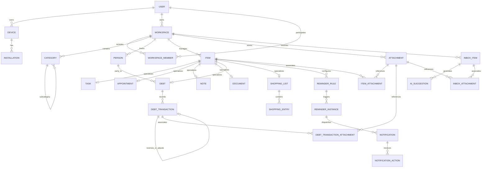
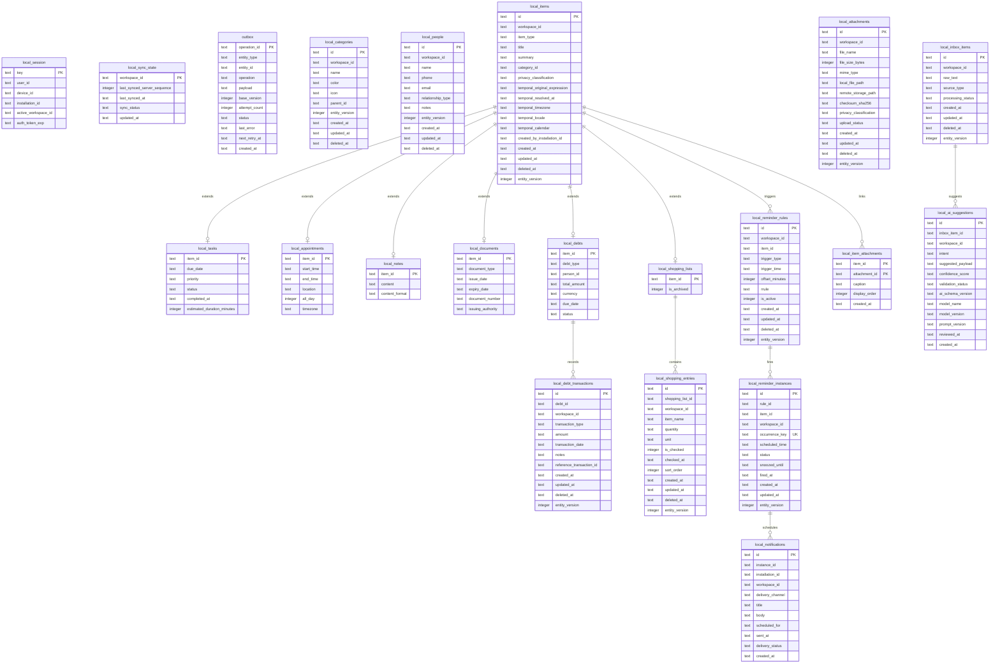

# ERD_FINAL v1.0 REPORT — مشروع «مُعين»
## المعمارية التنفيذية لنموذج البيانات والمزامنة (Data & Persistence Architecture Specification)

---

## 1. Executive Summary (الملخص التنفيذي)

يقدم هذا التقرير الوثيقة التنفيذية المعتمدة **`ERD_FINAL v1.0`** لمشروع **«مُعين» (Mouin)**، استنادًا إلى:
1. `PRD v1.1`
2. `ARCHITECTURE_BASELINE v1.0`
3. `DATA_API_SYNC_CONTRACT v1.0 FINAL`

تم تصميم هذا النموذج ليكون **ترجمة معمارية وتنفيذية دقيقة ومباشرة** للعقد المعتمد، بحيث يمكن اشتقاق الآتي منه فورًا ودون الحاجة لأي قرارات تصميمية أو معمارية لاحقة:
* **PostgreSQL Schema** (مع كامل القيود، المفاتيح، الفهارس، وأنواع البيانات الدقيقة للإنتاج والخادم).
* **SQLite Local Schema** (النموذج المحلي للهاتف المحمول في Flutter مع Outbox والمزامنة والبحث FTS).
* **FastAPI Persistence Models & Schemas** (نماذج ORM / Pydantic).
* **Flutter Local Entities & Sync Engine** (كيانات Drift / SQLite ومحرك المزامنة غير المتصل).

### المبادئ الصارمة المطبقة في هذا الإصدار:
1. **Local-First Identity**: كل كيان قابل للمزامنة ينشأ بمعرف `UUIDv7` على العميل المحلي (`Offline`) دون الاعتماد على الخادم لتوليد المفاتيح.
2. **Server Sequence Replication**: تسلسل المزامنة على الخادم `server_sequence` هو `BIGINT Sequence` مستقل ومخصص لـ Sync Change Stream، بينما إصدار الكيان `entity_version` هو عداد تحكم تصاعدي `INT`.
3. **Item Aggregate Root**: الكيان `Item` هو جذر التجميع (Aggregate Root) لجميع الأنواع التخصصية (`task`, `appointment`, `note`, `document`, `debt`, `shopping`).
4. **Reminder Decoupling**: التذكير **ليس** نوع Item، بل هو نظام فرعي مستقل ومغلق بدورة حياة رباعية:
   $$\text{ReminderRule} \longrightarrow \text{ReminderInstance} \ (\text{مع occurrence\_key}) \longrightarrow \text{Notification} \longrightarrow \text{Action}$$
5. **Append-Oriented Financial Integrity**: الديون والمدفوعات تستخدم `NUMERIC(14, 2)` حصراً، ولا يتم تعديل القيود المالية مباشرة بل عبر `Reversals` و `Adjustments`، مما يضمن دمج حركات الدفع غير المتصلة بأمان تام رياضياً وبدون تعارض.
6. **Polymorphism Prevention in Attachments**: إلغاء الحقول غير المنضبطة (`owner_type`, `owner_id`) واعتماد جداول ربط صريحة ذات تكامل مرجعي صارم (`Foreign Keys`).
7. **Strict AI/Domain Boundary**: لا يملك الذكاء الاصطناعي أي سلطة مباشرة لتعديل قاعدة البيانات (`AI ≠ Domain Mutation`). المسار صارم: إدخال $\rightarrow$ معالجة $\rightarrow$ اقتراح (`Suggestion`) $\rightarrow$ مراجعة المستخدم/السياسات $\rightarrow$ أمر نطاقي (`Domain Command`).
8. **Event vs Sync Change Decoupling**: فصل تام بين جدول الأحداث التدقيقية `events` (What happened?) وجدول تدفق المزامنة `sync_changes` (Replication Log).
9. **Atomic Outbox & Pull**: التزام تام بالمعاملات الذرية (`ACID Transactions`) في عمليتي الإرسال (`Domain + Outbox`) والاستقبال (`Apply Changes + Advance Cursor`).

---

## 2. Source Documents (الوثائق المرجعية المعتمدة)

تم بناء ومطابقة هذا الـ ERD بدقة مع الوثائق الرسمية التالية:
* **`PRD v1.1 (Product Requirements Document)`**: وثيقة متطلبات منتج مُعين، المحددة لخصائص المهام، المواعيد، الملاحظات، الوثائق، الديون، التسوق، والذكاء الاصطناعي وإدارة الهوية.
* **`ARCHITECTURE_BASELINE v1.0`**: الميثاق المعماري الملزم (Flutter + SQLite محلياً، Python FastAPI + PostgreSQL سحابياً، Object Storage للمرفقات، وانعدام Microservices أو Event Sourcing في الـ MVP).
* **`DATA_API_SYNC_CONTRACT v1.0 FINAL`**: عقد البيانات والمزامنة الشامل الذي يحدد بروتوكول المزامنة، بنية الحزم، التكرار، والتعامل مع حالات عدم الاتصال.

---

## 3. Domain Entities (الكيانات النطاقية المعتمدة)

### 3.1 الهوية والمساحة والأجهزة (Identity & Access)
* **`User`**: المالك الأساسي للبيانات والحساب.
* **`Device`**: الجهاز الفيزيائي للمستخدم (موبايل، تابلت، حاسوب).
* **`Installation`**: تثبيت محدد للتطبيق على جهاز فيزيائي (يتيح إعادة التثبيت دون كسر الهوية).
* **`Workspace`**: مساحة العمل المجمعة للبيانات (في الـ MVP: مساحة شخصية `personal workspace` لكل مستخدم، ومجهزة معمارياً للتوسع).
* **`WorkspaceMember`**: عضوية المستخدم في مساحة العمل والصلاحيات.

### 3.2 الكيان الجامع والأنواع التخصصية (Item Aggregate & Subtypes)
* **`Item` (Aggregate Root)**: الكيان الأم الحامل للبيانات المشتركة (العنوان، التصنيف، الخصوصية، معلومات الوقت الأصلية، الإصدار).
* **`Task`**: كيان تخصصي للمهام (تاريخ الاستحقاق، الأولوية، حالة الإنجاز، وقت الإنجاز).
* **`Appointment`**: كيان تخصصي للمواعيد (وقت البدء، وقت الانتهاء، المكان، طوال اليوم، النطاق الزمني).
* **`Note`**: كيان تخصصي للملاحظات والنصوص الحرة ومسودات الأفكار.
* **`Document`**: كيان تخصصي لإدارة الوثائق والبطاقات وتواريخ الانتهاء والأرقام الرسمية.
* **`Debt`**: كيان تخصصي لإدارة الديون والالتزامات المالية (دائن/مدين، الشخص، المبلغ الكلي، العملة).
* **`DebtTransaction`**: الحركات المالية التراكمية (دفعات، تسويات، عكس حركات).
* **`ShoppingList` & `ShoppingEntry`**: قوائم التسوق والمشتريات وعناصرها المفصلة.

### 3.3 الكيانات المرجعية (Master Data)
* **`Person`**: جهات الاتصال والأشخاص المرتبطين بالمعاملات والديون.
* **`Category`**: التصنيفات الهرمية لتنظيم العناصر.

### 3.4 نظام التذكيرات والإشعارات (Reminders & Notifications Subsystem)
* **`ReminderRule`**: قواعد التذكير (مطلقة، نسبية، متكررة).
* **`ReminderInstance`**: التكرار الفعلي المجدول مع مفتاح المنع الفريد `occurrence_key`.
* **`Notification`**: الإشعار الفعلي المرسل للجهاز/التثبيت عبر قنوات التوصيل.
* **`NotificationAction`**: استجابة المستخدم على الإشعار (تأجيل، إكمال، فتح).

### 3.5 المرفقات والوسائط (Attachments Subsystem)
* **`Attachment`**: سجل البيانات الوصفية للملف وتصنيف الخصوصية والتجزئة.
* **`ItemAttachment` / `DebtTransactionAttachment` / `InboxAttachment`**: جداول ربط صريحة تحافظ على التكامل المرجعي.

### 3.6 صندوق الوارد والذكاء الاصطناعي (Inbox & AI Suggestions)
* **`InboxItem`**: المادة الخام الملتقطة (نص، صوت، صورة).
* **`AISuggestion`**: الاقتراح النطاقي الناتج عن معالجة الذكاء الاصطناعي، غير المكتوب في جداول النطاق مباشرة.

### 3.7 الأحداث والمزامنة (Events & Sync Infrastructure)
* **`Event`**: سجل التدقيق ورصد ما حدث (`What happened?`) غير مخصص للمزامنة.
* **`SyncChange`**: سجل تدفق التغييرات المتسلسل على الخادم المخصص للمزامنة السحابية.
* **`SyncIdempotency`**: سجل ضمان عدم التكرار على الخادم باستخدام `operation_id`.
* **`SyncConflict`**: سجل توثيق التعارضات النطاقية واستراتيجيات حلها.

---

## 4. Domain Relationships (العلاقات النطاقية الأساسية)

```text
[User] 1 ──── * [Device] 1 ──── * [Installation]
  │
  ├──── 1 ──── * [Workspace] 1 ──── * [WorkspaceMember]
                   │
                   ├──── 1 ──── * [Category] (Self-referencing tree)
                   ├──── 1 ──── * [Person]
                   │
                   ├──── 1 ──── * [Item] (Aggregate Root)
                   │                ├── 1:1 ── [Task]
                   │                ├── 1:1 ── [Appointment]
                   │                ├── 1:1 ── [Note]
                   │                ├── 1:1 ── [Document]
                   │                ├── 1:1 ── [Debt] 1 ── * [DebtTransaction]
                   │                └── 1:1 ── [ShoppingList] 1 ── * [ShoppingEntry]
                   │
                   ├──── 1 ──── * [ReminderRule] 1 ──── * [ReminderInstance] 1 ──── * [Notification] 1 ── * [NotificationAction]
                   │
                   ├──── 1 ──── * [Attachment]
                   │                ├── *:* ── [ItemAttachment] ── [Item]
                   │                ├── *:* ── [DebtTransactionAttachment] ── [DebtTransaction]
                   │                └── *:* ── [InboxAttachment] ── [InboxItem]
                   │
                   ├──── 1 ──── * [InboxItem] 1 ──── * [AISuggestion]
                   │
                   ├──── 1 ──── * [Event] (Audit Log)
                   │
                   └──── 1 ──── * [SyncChange] (Replication Stream)
```

---

## 5. Domain ERD (مخطط النطاق المفاهيمي)



---

## 6. PostgreSQL ERD (مخطط قاعدة بيانات الخادم)

```mermaid
erDiagram
    users {
        uuid id PK
        varchar email UK
        varchar phone_number UK
        text password_hash
        varchar full_name
        boolean is_active
        timestamptz created_at
        timestamptz updated_at
        timestamptz deleted_at
    }

    devices {
        uuid id PK
        uuid user_id FK
        varchar device_fingerprint
        varchar device_name
        varchar device_type
        varchar os_version
        timestamptz created_at
        timestamptz last_seen_at
    }

    installations {
        uuid id PK
        uuid device_id FK
        uuid user_id FK
        varchar app_version
        text push_token
        int sync_protocol_version
        boolean is_active
        timestamptz installed_at
        timestamptz last_active_at
    }

    workspaces {
        uuid id PK
        uuid owner_user_id FK
        varchar name
        varchar type
        jsonb settings
        timestamptz created_at
        timestamptz updated_at
        timestamptz deleted_at
        int entity_version
    }

    workspace_members {
        uuid id PK
        uuid workspace_id FK
        uuid user_id FK
        varchar role
        timestamptz joined_at
        timestamptz deleted_at
    }

    categories {
        uuid id PK
        uuid workspace_id FK
        varchar name
        varchar color
        varchar icon
        uuid parent_id FK
        int entity_version
        timestamptz created_at
        timestamptz updated_at
        timestamptz deleted_at
    }

    people {
        uuid id PK
        uuid workspace_id FK
        varchar name
        varchar phone
        varchar email
        varchar relationship_type
        text notes
        int entity_version
        timestamptz created_at
        timestamptz updated_at
        timestamptz deleted_at
    }

    items {
        uuid id PK
        uuid workspace_id FK
        varchar item_type
        varchar title
        text summary
        uuid category_id FK
        varchar privacy_classification
        text temporal_original_expression
        timestamptz temporal_resolved_at
        varchar temporal_timezone
        varchar temporal_locale
        varchar temporal_calendar
        uuid created_by_installation_id FK
        timestamptz created_at
        timestamptz updated_at
        timestamptz deleted_at
        int entity_version
    }

    tasks {
        uuid item_id PK_FK
        timestamptz due_date
        varchar priority
        varchar status
        timestamptz completed_at
        int estimated_duration_minutes
    }

    appointments {
        uuid item_id PK_FK
        timestamptz start_time
        timestamptz end_time
        text location
        boolean all_day
        varchar timezone
    }

    notes {
        uuid item_id PK_FK
        text content
        varchar content_format
    }

    documents {
        uuid item_id PK_FK
        varchar document_type
        date issue_date
        date expiry_date
        varchar document_number
        varchar issuing_authority
    }

    debts {
        uuid item_id PK_FK
        varchar debt_type
        uuid person_id FK
        numeric total_amount
        varchar currency
        date due_date
        varchar status
    }

    debt_transactions {
        uuid id PK
        uuid debt_id FK
        uuid workspace_id FK
        varchar transaction_type
        numeric amount
        date transaction_date
        text notes
        uuid reference_transaction_id FK
        timestamptz created_at
        timestamptz updated_at
        timestamptz deleted_at
        int entity_version
    }

    shopping_lists {
        uuid item_id PK_FK
        boolean is_archived
    }

    shopping_entries {
        uuid id PK
        uuid shopping_list_id FK
        uuid workspace_id FK
        varchar item_name
        numeric quantity
        varchar unit
        boolean is_checked
        timestamptz checked_at
        int sort_order
        timestamptz created_at
        timestamptz updated_at
        timestamptz deleted_at
        int entity_version
    }

    reminder_rules {
        uuid id PK
        uuid workspace_id FK
        uuid item_id FK
        varchar trigger_type
        timestamptz trigger_time
        int offset_minutes
        text rrule
        boolean is_active
        timestamptz created_at
        timestamptz updated_at
        timestamptz deleted_at
        int entity_version
    }

    reminder_instances {
        uuid id PK
        uuid rule_id FK
        uuid item_id FK
        uuid workspace_id FK
        varchar occurrence_key UK
        timestamptz scheduled_time
        varchar status
        timestamptz snoozed_until
        timestamptz fired_at
        timestamptz created_at
        timestamptz updated_at
        int entity_version
    }

    notifications {
        uuid id PK
        uuid instance_id FK
        uuid installation_id FK
        uuid workspace_id FK
        varchar delivery_channel
        varchar title
        text body
        timestamptz scheduled_for
        timestamptz sent_at
        varchar delivery_status
        timestamptz created_at
    }

    notification_actions {
        uuid id PK
        uuid notification_id FK
        varchar action_type
        timestamptz acted_at
        jsonb payload
    }

    attachments {
        uuid id PK
        uuid workspace_id FK
        varchar file_name
        bigint file_size_bytes
        varchar mime_type
        text storage_path
        varchar checksum_sha256
        varchar privacy_classification
        uuid created_by_user_id FK
        timestamptz created_at
        timestamptz updated_at
        timestamptz deleted_at
        int entity_version
    }

    item_attachments {
        uuid item_id PK_FK
        uuid attachment_id PK_FK
        text caption
        int display_order
        timestamptz created_at
    }

    debt_transaction_attachments {
        uuid transaction_id PK_FK
        uuid attachment_id PK_FK
        timestamptz created_at
    }

    inbox_attachments {
        uuid inbox_item_id PK_FK
        uuid attachment_id PK_FK
        timestamptz created_at
    }

    inbox_items {
        uuid id PK
        uuid workspace_id FK
        text raw_text
        varchar source_type
        varchar processing_status
        uuid created_by_installation_id FK
        timestamptz created_at
        timestamptz updated_at
        timestamptz deleted_at
        int entity_version
    }

    ai_suggestions {
        uuid id PK
        uuid inbox_item_id FK
        uuid workspace_id FK
        varchar intent
        jsonb suggested_payload
        numeric confidence_score
        varchar validation_status
        varchar ai_schema_version
        varchar model_name
        varchar model_version
        varchar prompt_version
        uuid reviewed_by_user_id FK
        timestamptz reviewed_at
        timestamptz created_at
    }

    events {
        uuid id PK
        uuid workspace_id FK
        uuid user_id FK
        uuid installation_id FK
        varchar event_type
        varchar aggregate_type
        uuid aggregate_id
        jsonb payload
        timestamptz occurred_at
        timestamptz recorded_at
    }

    sync_changes {
        bigint server_sequence PK
        uuid workspace_id FK
        varchar entity_type
        uuid entity_id
        varchar operation
        int entity_version
        uuid source_installation_id FK
        uuid operation_id
        jsonb change_payload
        timestamptz created_at
    }

    sync_idempotency {
        uuid operation_id PK
        uuid workspace_id FK
        uuid installation_id FK
        varchar entity_type
        uuid entity_id
        varchar payload_hash_sha256
        timestamptz first_received_at
        varchar status
        jsonb response_summary
    }

    sync_conflicts {
        uuid id PK
        uuid workspace_id FK
        varchar entity_type
        uuid entity_id
        uuid source_installation_id FK
        int client_version
        int server_version
        jsonb client_payload
        jsonb server_payload
        varchar resolution_strategy
        jsonb resolved_payload
        timestamptz resolved_at
        timestamptz created_at
    }

    users ||--o{ devices : owns
    devices ||--o{ installations : hosts
    users ||--o{ workspaces : owns
    workspaces ||--o{ workspace_members : has
    users ||--o{ workspace_members : joins

    workspaces ||--o{ categories : contains
    categories ||--o{ categories : parent
    workspaces ||--o{ people : manages
    workspaces ||--o{ items : aggregates

    items ||--o| tasks : extends
    items ||--o| appointments : extends
    items ||--o| notes : extends
    items ||--o| documents : extends
    items ||--o| debts : extends
    items ||--o| shopping_lists : extends

    people ||--o{ debts : related
    debts ||--o{ debt_transactions : logs
    debt_transactions ||--o| debt_transactions : refers
    shopping_lists ||--o{ shopping_entries : contains

    items ||--o{ reminder_rules : triggers
    reminder_rules ||--o{ reminder_instances : fires
    reminder_instances ||--o{ notifications : creates
    notifications ||--o{ notification_actions : records

    workspaces ||--o{ attachments : stores
    items ||--o{ item_attachments : links
    attachments ||--o{ item_attachments : linked_by
    debt_transactions ||--o{ debt_transaction_attachments : links
    attachments ||--o{ debt_transaction_attachments : linked_by
    inbox_items ||--o{ inbox_attachments : links
    attachments ||--o{ inbox_attachments : linked_by

    workspaces ||--o{ inbox_items : collects
    inbox_items ||--o{ ai_suggestions : generates

    workspaces ||--o{ events : logs
    workspaces ||--o{ sync_changes : streams
    workspaces ||--o{ sync_idempotency : tracks
    workspaces ||--o{ sync_conflicts : handles
```

---

## 7. SQLite ERD (مخطط قاعدة بيانات العميل المحلي - Flutter)



---

## 8. Entity Classification Table (جدول تصنيف الكيانات)

| الكيان (Entity) | التصنيف النطاقي / المعماري | PostgreSQL | SQLite | قابل للمزامنة (Syncable) | المالك النطاقي (Ownership) | معرف الكيان (PK Strategy) |
| :--- | :--- | :---: | :---: | :---: | :--- | :--- |
| **User** | Domain (Security/Identity) | Yes | Yes (Session) | Partial (Profile) | Self | UUIDv7 |
| **Device** | Infrastructure / Identity | Yes | Yes (Session) | Yes (Register) | User | UUIDv7 |
| **Installation** | Infrastructure / Identity | Yes | Yes (Session) | Yes (Register) | Device / User | UUIDv7 |
| **Workspace** | Domain Boundary | Yes | Yes (Active) | Yes | User (Owner) | UUIDv7 |
| **WorkspaceMember** | Domain (Access Control) | Yes | No (MVP local) | Yes | Workspace | UUIDv7 |
| **Category** | Domain Master Data | Yes | Yes | Yes | Workspace | UUIDv7 |
| **Person** | Domain Master Data | Yes | Yes | Yes | Workspace | UUIDv7 |
| **Item** | **Aggregate Root** | Yes | Yes | Yes | Workspace | UUIDv7 |
| **Task** | Domain Subtype Model | Yes | Yes | Yes | Item (1:1) | UUIDv7 (`item_id`) |
| **Appointment** | Domain Subtype Model | Yes | Yes | Yes | Item (1:1) | UUIDv7 (`item_id`) |
| **Note** | Domain Subtype Model | Yes | Yes | Yes | Item (1:1) | UUIDv7 (`item_id`) |
| **Document** | Domain Subtype Model | Yes | Yes | Yes | Item (1:1) | UUIDv7 (`item_id`) |
| **Debt** | Domain Subtype Model | Yes | Yes | Yes | Item (1:1) | UUIDv7 (`item_id`) |
| **DebtTransaction** | Domain Financial (Append-only) | Yes | Yes | Yes | Debt / Workspace | UUIDv7 |
| **ShoppingList** | Domain Subtype Model | Yes | Yes | Yes | Item (1:1) | UUIDv7 (`item_id`) |
| **ShoppingEntry** | Domain Child Entity | Yes | Yes | Yes | ShoppingList | UUIDv7 |
| **ReminderRule** | Domain (Scheduling Rule) | Yes | Yes | Yes | Item / Workspace | UUIDv7 |
| **ReminderInstance**| Operational / Domain Execution | Yes | Yes | Yes | Rule / Item | UUIDv7 |
| **Notification** | Infrastructure (Delivery) | Yes | Yes | Local/Optional | Installation | UUIDv7 |
| **NotificationAction**| Observability / Action | Yes | Optional | No (Direct Cmd) | Notification | UUIDv7 |
| **Attachment** | Domain Asset Meta | Yes | Yes | Yes (Meta+Blob) | Workspace | UUIDv7 |
| **ItemAttachment** | Association Table | Yes | Yes | Yes | Item + Attachment | Composite PK |
| **DebtTxAttachment**| Association Table | Yes | Yes | Yes | DebtTx + Attachment | Composite PK |
| **InboxAttachment** | Association Table | Yes | Yes | Yes | Inbox + Attachment | Composite PK |
| **InboxItem** | Pipeline Capture Entity | Yes | Yes | Yes | Workspace | UUIDv7 |
| **AISuggestion** | AI Staging / Transient | Yes | Yes | Yes | InboxItem | UUIDv7 |
| **Event** | Infrastructure / Audit Log | Yes | No (Local Log) | No (Internal) | Workspace / User | UUIDv7 |
| **SyncChange** | Sync Infrastructure Stream | Yes | No | **Replication Log** | Workspace | `BIGINT Sequence` |
| **SyncIdempotency** | Sync Infrastructure (Gate) | Yes | No | No (Server-only) | Workspace / Op | UUIDv7 (`op_id`) |
| **SyncConflict** | Sync Resolution Audit | Yes | Optional | No (Resolved) | Workspace | UUIDv7 |
| **Outbox** | Sync Client Infrastructure | No | **Yes** | Client Outgoing | Local Client | UUIDv7 (`op_id`) |
| **LocalSyncState** | Operational State | No | **Yes** | Client Cursor | Local Client | Workspace (`cursor`) |

---

## 9. PostgreSQL Table Registry (سجل جداول الخادم)

### 9.1 `users`
* **الغرض**: تسجيل الحسابات وهوية أصحاب البيانات.
* **PK**: `id` (UUIDv7).
* **الحقول**:
  * `id`: `UUID NOT NULL PRIMARY KEY`
  * `email`: `VARCHAR(255) NOT NULL UNIQUE`
  * `phone_number`: `VARCHAR(32) NULL UNIQUE`
  * `password_hash`: `TEXT NOT NULL`
  * `full_name`: `VARCHAR(128) NOT NULL`
  * `is_active`: `BOOLEAN NOT NULL DEFAULT TRUE`
  * `created_at`: `TIMESTAMPTZ NOT NULL DEFAULT CURRENT_TIMESTAMP`
  * `updated_at`: `TIMESTAMPTZ NOT NULL DEFAULT CURRENT_TIMESTAMP`
  * `deleted_at`: `TIMESTAMPTZ NULL`
* **الفهارس**: `idx_users_email`, `idx_users_phone`, `idx_users_deleted_at`.
* **الحذف**: Soft Delete (`deleted_at`).

### 9.2 `devices`
* **الغرض**: تمثيل الجهاز الفيزيائي للمستخدم.
* **PK**: `id` (UUIDv7).
* **الحقول**:
  * `id`: `UUID NOT NULL PRIMARY KEY`
  * `user_id`: `UUID NOT NULL REFERENCES users(id) ON DELETE CASCADE`
  * `device_fingerprint`: `VARCHAR(128) NOT NULL`
  * `device_name`: `VARCHAR(128) NOT NULL`
  * `device_type`: `VARCHAR(32) NOT NULL` (android, ios, windows, macos, web)
  * `os_version`: `VARCHAR(64) NOT NULL`
  * `created_at`: `TIMESTAMPTZ NOT NULL DEFAULT CURRENT_TIMESTAMP`
  * `last_seen_at`: `TIMESTAMPTZ NOT NULL DEFAULT CURRENT_TIMESTAMP`
* **القيود**: `UNIQUE(user_id, device_fingerprint)`.
* **الفهارس**: `idx_devices_user_id`.

### 9.3 `installations`
* **الغرض**: تمثيل تثبيت محدد لتطبيق مُعين على جهاز المستخدم، وتتبع الرموز وإصدارات المزامنة.
* **PK**: `id` (UUIDv7).
* **الحقول**:
  * `id`: `UUID NOT NULL PRIMARY KEY`
  * `device_id`: `UUID NOT NULL REFERENCES devices(id) ON DELETE CASCADE`
  * `user_id`: `UUID NOT NULL REFERENCES users(id) ON DELETE CASCADE`
  * `app_version`: `VARCHAR(32) NOT NULL`
  * `push_token`: `TEXT NULL`
  * `sync_protocol_version`: `INT NOT NULL DEFAULT 1`
  * `is_active`: `BOOLEAN NOT NULL DEFAULT TRUE`
  * `installed_at`: `TIMESTAMPTZ NOT NULL DEFAULT CURRENT_TIMESTAMP`
  * `last_active_at`: `TIMESTAMPTZ NOT NULL DEFAULT CURRENT_TIMESTAMP`
* **الفهارس**: `idx_installations_device_id`, `idx_installations_user_id`.

### 9.4 `workspaces`
* **الغرض**: حدود عزل البيانات والصلاحيات (Personal Workspace في MVP).
* **PK**: `id` (UUIDv7).
* **الحقول**:
  * `id`: `UUID NOT NULL PRIMARY KEY`
  * `owner_user_id`: `UUID NOT NULL REFERENCES users(id) ON DELETE RESTRICT`
  * `name`: `VARCHAR(128) NOT NULL`
  * `type`: `VARCHAR(32) NOT NULL DEFAULT 'personal'` (`CHECK (type IN ('personal', 'family', 'team'))`)
  * `settings`: `JSONB NOT NULL DEFAULT '{}'::jsonb`
  * `created_at`: `TIMESTAMPTZ NOT NULL DEFAULT CURRENT_TIMESTAMP`
  * `updated_at`: `TIMESTAMPTZ NOT NULL DEFAULT CURRENT_TIMESTAMP`
  * `deleted_at`: `TIMESTAMPTZ NULL`
  * `entity_version`: `INT NOT NULL DEFAULT 1`
* **الفهارس**: `idx_workspaces_owner`, `idx_workspaces_deleted_at`.

### 9.5 `workspace_members`
* **الغرض**: ربط المستخدمين بمساحات العمل وإدارة الصلاحيات.
* **PK**: `id` (UUIDv7).
* **الحقول**:
  * `id`: `UUID NOT NULL PRIMARY KEY`
  * `workspace_id`: `UUID NOT NULL REFERENCES workspaces(id) ON DELETE CASCADE`
  * `user_id`: `UUID NOT NULL REFERENCES users(id) ON DELETE CASCADE`
  * `role`: `VARCHAR(32) NOT NULL DEFAULT 'owner'` (`CHECK (role IN ('owner', 'admin', 'member', 'viewer'))`)
  * `joined_at`: `TIMESTAMPTZ NOT NULL DEFAULT CURRENT_TIMESTAMP`
  * `deleted_at`: `TIMESTAMPTZ NULL`
* **القيود**: `UNIQUE(workspace_id, user_id)`.
* **الفهارس**: `idx_workspace_members_lookup`.

### 9.6 `categories`
* **الغرض**: التصنيفات النطاقية المخصصة لتنظيم العناصر.
* **PK**: `id` (UUIDv7).
* **الحقول**:
  * `id`: `UUID NOT NULL PRIMARY KEY`
  * `workspace_id`: `UUID NOT NULL REFERENCES workspaces(id) ON DELETE CASCADE`
  * `name`: `VARCHAR(64) NOT NULL`
  * `color`: `VARCHAR(16) NOT NULL DEFAULT '#6750A4'`
  * `icon`: `VARCHAR(64) NOT NULL DEFAULT 'folder'`
  * `parent_id`: `UUID NULL REFERENCES categories(id) ON DELETE SET NULL`
  * `entity_version`: `INT NOT NULL DEFAULT 1`
  * `created_at`: `TIMESTAMPTZ NOT NULL DEFAULT CURRENT_TIMESTAMP`
  * `updated_at`: `TIMESTAMPTZ NOT NULL DEFAULT CURRENT_TIMESTAMP`
  * `deleted_at`: `TIMESTAMPTZ NULL`
* **الفهارس**: `idx_categories_workspace`, `idx_categories_parent`.

### 9.7 `people`
* **الغرض**: جهات الاتصال والأشخاص المرتبطين بالمعاملات والديون.
* **PK**: `id` (UUIDv7).
* **الحقول**:
  * `id`: `UUID NOT NULL PRIMARY KEY`
  * `workspace_id`: `UUID NOT NULL REFERENCES workspaces(id) ON DELETE CASCADE`
  * `name`: `VARCHAR(128) NOT NULL`
  * `phone`: `VARCHAR(32) NULL`
  * `email`: `VARCHAR(255) NULL`
  * `relationship_type`: `VARCHAR(64) NULL`
  * `notes`: `TEXT NULL`
  * `entity_version`: `INT NOT NULL DEFAULT 1`
  * `created_at`: `TIMESTAMPTZ NOT NULL DEFAULT CURRENT_TIMESTAMP`
  * `updated_at`: `TIMESTAMPTZ NOT NULL DEFAULT CURRENT_TIMESTAMP`
  * `deleted_at`: `TIMESTAMPTZ NULL`
* **الفهارس**: `idx_people_workspace`, `idx_people_name`.

### 9.8 `items` (Aggregate Root)
* **الغرض**: الجذر التجميعي لجميع الكيانات المتخصصة في التطبيق.
* **PK**: `id` (UUIDv7).
* **الحقول**:
  * `id`: `UUID NOT NULL PRIMARY KEY`
  * `workspace_id`: `UUID NOT NULL REFERENCES workspaces(id) ON DELETE CASCADE`
  * `item_type`: `VARCHAR(32) NOT NULL` (`CHECK (item_type IN ('task', 'appointment', 'note', 'document', 'debt', 'shopping'))`)
  * `title`: `VARCHAR(255) NOT NULL`
  * `summary`: `TEXT NULL`
  * `category_id`: `UUID NULL REFERENCES categories(id) ON DELETE SET NULL`
  * `privacy_classification`: `VARCHAR(32) NOT NULL DEFAULT 'private'` (`CHECK (privacy_classification IN ('private', 'sensitive'))`)
  * `temporal_original_expression`: `TEXT NULL` (النص الزمني الطبيعي المدخل مثل "الخميس القادم الساعة 7")
  * `temporal_resolved_at`: `TIMESTAMPTZ NULL`
  * `temporal_timezone`: `VARCHAR(64) NULL` (مثل `Asia/Aden`)
  * `temporal_locale`: `VARCHAR(16) NULL DEFAULT 'ar'`
  * `temporal_calendar`: `VARCHAR(16) NULL DEFAULT 'gregorian'`
  * `created_by_installation_id`: `UUID NULL REFERENCES installations(id) ON DELETE SET NULL`
  * `created_at`: `TIMESTAMPTZ NOT NULL DEFAULT CURRENT_TIMESTAMP`
  * `updated_at`: `TIMESTAMPTZ NOT NULL DEFAULT CURRENT_TIMESTAMP`
  * `deleted_at`: `TIMESTAMPTZ NULL`
  * `entity_version`: `INT NOT NULL DEFAULT 1`
* **الفهارس**: `idx_items_ws_type` (`workspace_id`, `item_type`), `idx_items_created_at`, `idx_items_deleted_at`.

### 9.9 `tasks`
* **الغرض**: تفاصيل المهام.
* **PK/FK**: `item_id` (`UUID NOT NULL PRIMARY KEY REFERENCES items(id) ON DELETE CASCADE`).
* **الحقول**:
  * `item_id`: `UUID PRIMARY KEY`
  * `due_date`: `TIMESTAMPTZ NULL`
  * `priority`: `VARCHAR(16) NOT NULL DEFAULT 'medium'` (`CHECK (priority IN ('low', 'medium', 'high', 'urgent'))`)
  * `status`: `VARCHAR(16) NOT NULL DEFAULT 'pending'` (`CHECK (status IN ('pending', 'in_progress', 'completed', 'cancelled'))`)
  * `completed_at`: `TIMESTAMPTZ NULL`
  * `estimated_duration_minutes`: `INT NULL CHECK (estimated_duration_minutes > 0)`
* **الفهارس**: `idx_tasks_status_due` (`status`, `due_date`).

### 9.10 `appointments`
* **الغرض**: تفاصيل المواعيد واللقاءات والتقويم.
* **PK/FK**: `item_id` (`UUID NOT NULL PRIMARY KEY REFERENCES items(id) ON DELETE CASCADE`).
* **الحقول**:
  * `item_id`: `UUID PRIMARY KEY`
  * `start_time`: `TIMESTAMPTZ NOT NULL`
  * `end_time`: `TIMESTAMPTZ NULL`
  * `location`: `TEXT NULL`
  * `all_day`: `BOOLEAN NOT NULL DEFAULT FALSE`
  * `timezone`: `VARCHAR(64) NOT NULL DEFAULT 'Asia/Aden'`
* **القيود**: `CHECK (end_time IS NULL OR end_time >= start_time)`.
* **الفهارس**: `idx_appointments_start_time`.

### 9.11 `notes`
* **الغرض**: الملاحظات النصية والنصوص الحرة.
* **PK/FK**: `item_id` (`UUID NOT NULL PRIMARY KEY REFERENCES items(id) ON DELETE CASCADE`).
* **الحقول**:
  * `item_id`: `UUID PRIMARY KEY`
  * `content`: `TEXT NOT NULL`
  * `content_format`: `VARCHAR(32) NOT NULL DEFAULT 'plain_text'` (`CHECK (content_format IN ('plain_text', 'markdown'))`)

### 9.12 `documents`
* **الغرض**: الوثائق والأوراق الرسمية وتواريخ صلاحياتها.
* **PK/FK**: `item_id` (`UUID NOT NULL PRIMARY KEY REFERENCES items(id) ON DELETE CASCADE`).
* **الحقول**:
  * `item_id`: `UUID PRIMARY KEY`
  * `document_type`: `VARCHAR(64) NOT NULL` (هوية، جواز، رخصة، عقد)
  * `issue_date`: `DATE NULL`
  * `expiry_date`: `DATE NULL`
  * `document_number`: `VARCHAR(128) NULL`
  * `issuing_authority`: `VARCHAR(128) NULL`
* **القيود**: `CHECK (expiry_date IS NULL OR issue_date IS NULL OR expiry_date >= issue_date)`.
* **الفهارس**: `idx_documents_expiry_date`.

### 9.13 `debts`
* **الغرض**: التزامات الديون (دائن أو مدين).
* **PK/FK**: `item_id` (`UUID NOT NULL PRIMARY KEY REFERENCES items(id) ON DELETE CASCADE`).
* **الحقول**:
  * `item_id`: `UUID PRIMARY KEY`
  * `debt_type`: `VARCHAR(16) NOT NULL` (`CHECK (debt_type IN ('payable', 'receivable'))`)
  * `person_id`: `UUID NOT NULL REFERENCES people(id) ON DELETE RESTRICT`
  * `total_amount`: `NUMERIC(14, 2) NOT NULL CHECK (total_amount > 0)`
  * `currency`: `VARCHAR(3) NOT NULL DEFAULT 'YER'`
  * `due_date`: `DATE NULL`
  * `status`: `VARCHAR(16) NOT NULL DEFAULT 'active'` (`CHECK (status IN ('active', 'settled', 'defaulted', 'cancelled'))`)
* **الفهارس**: `idx_debts_person`, `idx_debts_status`.

### 9.14 `debt_transactions`
* **الغرض**: سجل الحركات التراكمية على الديون (حركات دفع، تسوية، عكس قيود).
* **PK**: `id` (UUIDv7).
* **الحقول**:
  * `id`: `UUID NOT NULL PRIMARY KEY`
  * `debt_id`: `UUID NOT NULL REFERENCES debts(item_id) ON DELETE CASCADE`
  * `workspace_id`: `UUID NOT NULL REFERENCES workspaces(id) ON DELETE CASCADE`
  * `transaction_type`: `VARCHAR(16) NOT NULL` (`CHECK (transaction_type IN ('payment', 'reversal', 'adjustment'))`)
  * `amount`: `NUMERIC(14, 2) NOT NULL CHECK (amount > 0)`
  * `transaction_date`: `DATE NOT NULL`
  * `notes`: `TEXT NULL`
  * `reference_transaction_id`: `UUID NULL REFERENCES debt_transactions(id) ON DELETE RESTRICT`
  * `created_at`: `TIMESTAMPTZ NOT NULL DEFAULT CURRENT_TIMESTAMP`
  * `updated_at`: `TIMESTAMPTZ NOT NULL DEFAULT CURRENT_TIMESTAMP`
  * `deleted_at`: `TIMESTAMPTZ NULL`
  * `entity_version`: `INT NOT NULL DEFAULT 1`
* **الفهارس**: `idx_debt_tx_debt_id`, `idx_debt_tx_workspace_id`.

### 9.15 `shopping_lists`
* **الغرض**: رأس قائمة التسوق.
* **PK/FK**: `item_id` (`UUID NOT NULL PRIMARY KEY REFERENCES items(id) ON DELETE CASCADE`).
* **الحقول**:
  * `item_id`: `UUID PRIMARY KEY`
  * `is_archived`: `BOOLEAN NOT NULL DEFAULT FALSE`

### 9.16 `shopping_entries`
* **الغرض**: عناصر وبنود قائمة التسوق.
* **PK**: `id` (UUIDv7).
* **الحقول**:
  * `id`: `UUID NOT NULL PRIMARY KEY`
  * `shopping_list_id`: `UUID NOT NULL REFERENCES shopping_lists(item_id) ON DELETE CASCADE`
  * `workspace_id`: `UUID NOT NULL REFERENCES workspaces(id) ON DELETE CASCADE`
  * `item_name`: `VARCHAR(255) NOT NULL`
  * `quantity`: `NUMERIC(10, 2) NOT NULL DEFAULT 1.00 CHECK (quantity > 0)`
  * `unit`: `VARCHAR(32) NULL`
  * `is_checked`: `BOOLEAN NOT NULL DEFAULT FALSE`
  * `checked_at`: `TIMESTAMPTZ NULL`
  * `sort_order`: `INT NOT NULL DEFAULT 0`
  * `created_at`: `TIMESTAMPTZ NOT NULL DEFAULT CURRENT_TIMESTAMP`
  * `updated_at`: `TIMESTAMPTZ NOT NULL DEFAULT CURRENT_TIMESTAMP`
  * `deleted_at`: `TIMESTAMPTZ NULL`
  * `entity_version`: `INT NOT NULL DEFAULT 1`
* **الفهارس**: `idx_shopping_entries_list` (`shopping_list_id`, `is_checked`, `sort_order`).

### 9.17 `reminder_rules`
* **الغرض**: قواعد جدولة التذكيرات المرتبطة بالعناصر.
* **PK**: `id` (UUIDv7).
* **الحقول**:
  * `id`: `UUID NOT NULL PRIMARY KEY`
  * `workspace_id`: `UUID NOT NULL REFERENCES workspaces(id) ON DELETE CASCADE`
  * `item_id`: `UUID NOT NULL REFERENCES items(id) ON DELETE CASCADE`
  * `trigger_type`: `VARCHAR(16) NOT NULL` (`CHECK (trigger_type IN ('relative', 'absolute', 'recurring'))`)
  * `trigger_time`: `TIMESTAMPTZ NULL`
  * `offset_minutes`: `INT NULL` (للإشعارات النسبية مثل -15 قبل الموعد)
  * `rrule`: `TEXT NULL` (iCalendar RFC 5545 RRULE للتكرار)
  * `is_active`: `BOOLEAN NOT NULL DEFAULT TRUE`
  * `created_at`: `TIMESTAMPTZ NOT NULL DEFAULT CURRENT_TIMESTAMP`
  * `updated_at`: `TIMESTAMPTZ NOT NULL DEFAULT CURRENT_TIMESTAMP`
  * `deleted_at`: `TIMESTAMPTZ NULL`
  * `entity_version`: `INT NOT NULL DEFAULT 1`
* **الفهارس**: `idx_reminder_rules_item_id`, `idx_reminder_rules_active`.

### 9.18 `reminder_instances`
* **الغرض**: التكرارات الفعلية المحسوبة للتذكير، مع منع التكرار.
* **PK**: `id` (UUIDv7).
* **الحقول**:
  * `id`: `UUID NOT NULL PRIMARY KEY`
  * `rule_id`: `UUID NOT NULL REFERENCES reminder_rules(id) ON DELETE CASCADE`
  * `item_id`: `UUID NOT NULL REFERENCES items(id) ON DELETE CASCADE`
  * `workspace_id`: `UUID NOT NULL REFERENCES workspaces(id) ON DELETE CASCADE`
  * `occurrence_key`: `VARCHAR(128) NOT NULL` (مفتاح فريد يمنع إنشاء نفس التكرار أكثر من مرة)
  * `scheduled_time`: `TIMESTAMPTZ NOT NULL`
  * `status`: `VARCHAR(16) NOT NULL DEFAULT 'pending'` (`CHECK (status IN ('pending', 'triggered', 'snoozed', 'dismissed', 'cancelled'))`)
  * `snoozed_until`: `TIMESTAMPTZ NULL`
  * `fired_at`: `TIMESTAMPTZ NULL`
  * `created_at`: `TIMESTAMPTZ NOT NULL DEFAULT CURRENT_TIMESTAMP`
  * `updated_at`: `TIMESTAMPTZ NOT NULL DEFAULT CURRENT_TIMESTAMP`
  * `entity_version`: `INT NOT NULL DEFAULT 1`
* **القيود**: `UNIQUE (rule_id, occurrence_key)`.
* **الفهارس**: `idx_reminder_instances_scheduled` (`status`, `scheduled_time`).

### 9.19 `notifications`
* **الغرض**: أوامر إرسال وتوصيل الإشعارات للأجهزة المحددة.
* **PK**: `id` (UUIDv7).
* **الحقول**:
  * `id`: `UUID NOT NULL PRIMARY KEY`
  * `instance_id`: `UUID NOT NULL REFERENCES reminder_instances(id) ON DELETE CASCADE`
  * `installation_id`: `UUID NOT NULL REFERENCES installations(id) ON DELETE CASCADE`
  * `workspace_id`: `UUID NOT NULL REFERENCES workspaces(id) ON DELETE CASCADE`
  * `delivery_channel`: `VARCHAR(32) NOT NULL DEFAULT 'local_push'` (`CHECK (delivery_channel IN ('local_push', 'system_tray'))`)
  * `title`: `VARCHAR(255) NOT NULL`
  * `body`: `TEXT NOT NULL`
  * `scheduled_for`: `TIMESTAMPTZ NOT NULL`
  * `sent_at`: `TIMESTAMPTZ NULL`
  * `delivery_status`: `VARCHAR(16) NOT NULL DEFAULT 'scheduled'` (`CHECK (delivery_status IN ('scheduled', 'delivered', 'failed', 'dismissed'))`)
  * `created_at`: `TIMESTAMPTZ NOT NULL DEFAULT CURRENT_TIMESTAMP`
* **الفهارس**: `idx_notifications_delivery` (`installation_id`, `delivery_status`, `scheduled_for`).

### 9.20 `notification_actions`
* **الغرض**: توثيق تفاعل المستخدم مع الإشعار.
* **PK**: `id` (UUIDv7).
* **الحقول**:
  * `id`: `UUID NOT NULL PRIMARY KEY`
  * `notification_id`: `UUID NOT NULL REFERENCES notifications(id) ON DELETE CASCADE`
  * `action_type`: `VARCHAR(32) NOT NULL` (`CHECK (action_type IN ('dismiss', 'snooze_5m', 'snooze_15m', 'snooze_1h', 'mark_done', 'view_item'))`)
  * `acted_at`: `TIMESTAMPTZ NOT NULL DEFAULT CURRENT_TIMESTAMP`
  * `payload`: `JSONB NULL`

### 9.21 `attachments`
* **الغرض**: البيانات الوصفية للملفات والمستندات المخزنة في Object Storage.
* **PK**: `id` (UUIDv7).
* **الحقول**:
  * `id`: `UUID NOT NULL PRIMARY KEY`
  * `workspace_id`: `UUID NOT NULL REFERENCES workspaces(id) ON DELETE CASCADE`
  * `file_name`: `VARCHAR(255) NOT NULL`
  * `file_size_bytes`: `BIGINT NOT NULL CHECK (file_size_bytes >= 0)`
  * `mime_type`: `VARCHAR(128) NOT NULL`
  * `storage_path`: `TEXT NOT NULL`
  * `checksum_sha256`: `VARCHAR(64) NOT NULL`
  * `privacy_classification`: `VARCHAR(32) NOT NULL DEFAULT 'private'` (`CHECK (privacy_classification IN ('private', 'sensitive'))`)
  * `created_by_user_id`: `UUID NOT NULL REFERENCES users(id) ON DELETE RESTRICT`
  * `created_at`: `TIMESTAMPTZ NOT NULL DEFAULT CURRENT_TIMESTAMP`
  * `updated_at`: `TIMESTAMPTZ NOT NULL DEFAULT CURRENT_TIMESTAMP`
  * `deleted_at`: `TIMESTAMPTZ NULL`
  * `entity_version`: `INT NOT NULL DEFAULT 1`
* **الفهارس**: `idx_attachments_workspace_id`, `idx_attachments_sha256`.

### 9.22 جداول ربط المرفقات (Explicit Associations)
* **`item_attachments`**:
  * `item_id`: `UUID NOT NULL REFERENCES items(id) ON DELETE CASCADE`
  * `attachment_id`: `UUID NOT NULL REFERENCES attachments(id) ON DELETE CASCADE`
  * `caption`: `TEXT NULL`
  * `display_order`: `INT NOT NULL DEFAULT 0`
  * `created_at`: `TIMESTAMPTZ NOT NULL DEFAULT CURRENT_TIMESTAMP`
  * `PRIMARY KEY (item_id, attachment_id)`
* **`debt_transaction_attachments`**:
  * `transaction_id`: `UUID NOT NULL REFERENCES debt_transactions(id) ON DELETE CASCADE`
  * `attachment_id`: `UUID NOT NULL REFERENCES attachments(id) ON DELETE CASCADE`
  * `created_at`: `TIMESTAMPTZ NOT NULL DEFAULT CURRENT_TIMESTAMP`
  * `PRIMARY KEY (transaction_id, attachment_id)`
* **`inbox_attachments`**:
  * `inbox_item_id`: `UUID NOT NULL REFERENCES inbox_items(id) ON DELETE CASCADE`
  * `attachment_id`: `UUID NOT NULL REFERENCES attachments(id) ON DELETE CASCADE`
  * `created_at`: `TIMESTAMPTZ NOT NULL DEFAULT CURRENT_TIMESTAMP`
  * `PRIMARY KEY (inbox_item_id, attachment_id)`

### 9.23 `inbox_items`
* **الغرض**: المواد الخام الملتقطة من الصوت أو الكتابة السريعة أو مشاركة النظام.
* **PK**: `id` (UUIDv7).
* **الحقول**:
  * `id`: `UUID NOT NULL PRIMARY KEY`
  * `workspace_id`: `UUID NOT NULL REFERENCES workspaces(id) ON DELETE CASCADE`
  * `raw_text`: `TEXT NOT NULL`
  * `source_type`: `VARCHAR(32) NOT NULL` (`CHECK (source_type IN ('voice_transcription', 'manual_quick_note', 'share_intent', 'image_scan'))`)
  * `processing_status`: `VARCHAR(32) NOT NULL DEFAULT 'pending'` (`CHECK (processing_status IN ('pending', 'processing', 'processed', 'rejected', 'error'))`)
  * `created_by_installation_id`: `UUID NULL REFERENCES installations(id) ON DELETE SET NULL`
  * `created_at`: `TIMESTAMPTZ NOT NULL DEFAULT CURRENT_TIMESTAMP`
  * `updated_at`: `TIMESTAMPTZ NOT NULL DEFAULT CURRENT_TIMESTAMP`
  * `deleted_at`: `TIMESTAMPTZ NULL`
  * `entity_version`: `INT NOT NULL DEFAULT 1`
* **الفهارس**: `idx_inbox_workspace_status` (`workspace_id`, `processing_status`).

### 9.24 `ai_suggestions`
* **الغرض**: مخرجات تحليل الذكاء الاصطناعي المؤقتة المهيأة لمراجعة واعتماد المستخدم.
* **PK**: `id` (UUIDv7).
* **الحقول**:
  * `id`: `UUID NOT NULL PRIMARY KEY`
  * `inbox_item_id`: `UUID NOT NULL REFERENCES inbox_items(id) ON DELETE CASCADE`
  * `workspace_id`: `UUID NOT NULL REFERENCES workspaces(id) ON DELETE CASCADE`
  * `intent`: `VARCHAR(64) NOT NULL` (مثل `create_task`, `create_debt`, `create_appointment`)
  * `suggested_payload`: `JSONB NOT NULL`
  * `confidence_score`: `NUMERIC(4, 3) NOT NULL CHECK (confidence_score >= 0.0 AND confidence_score <= 1.0)`
  * `validation_status`: `VARCHAR(32) NOT NULL DEFAULT 'pending_review'` (`CHECK (validation_status IN ('pending_review', 'accepted', 'rejected', 'edited'))`)
  * `ai_schema_version`: `VARCHAR(32) NOT NULL DEFAULT '1.0'`
  * `model_name`: `VARCHAR(64) NOT NULL`
  * `model_version`: `VARCHAR(64) NOT NULL`
  * `prompt_version`: `VARCHAR(32) NOT NULL`
  * `reviewed_by_user_id`: `UUID NULL REFERENCES users(id) ON DELETE SET NULL`
  * `reviewed_at`: `TIMESTAMPTZ NULL`
  * `created_at`: `TIMESTAMPTZ NOT NULL DEFAULT CURRENT_TIMESTAMP`
* **الفهارس**: `idx_ai_suggestions_inbox_id`, `idx_ai_suggestions_status`.

### 9.25 `events` (Audit & Observability Log)
* **الغرض**: تسجيل ما حدث على مستوى النظام للأمان والتدقيق والمراقبة (**ليس قناة مزامنة**).
* **PK**: `id` (UUIDv7).
* **الحقول**:
  * `id`: `UUID NOT NULL PRIMARY KEY`
  * `workspace_id`: `UUID NOT NULL REFERENCES workspaces(id) ON DELETE CASCADE`
  * `user_id`: `UUID NULL REFERENCES users(id) ON DELETE SET NULL`
  * `installation_id`: `UUID NULL REFERENCES installations(id) ON DELETE SET NULL`
  * `event_type`: `VARCHAR(128) NOT NULL` (مثل `task.completed`, `debt.payment_added`, `suggestion.confirmed`)
  * `aggregate_type`: `VARCHAR(64) NOT NULL`
  * `aggregate_id`: `UUID NOT NULL`
  * `payload`: `JSONB NOT NULL`
  * `occurred_at`: `TIMESTAMPTZ NOT NULL`
  * `recorded_at`: `TIMESTAMPTZ NOT NULL DEFAULT CURRENT_TIMESTAMP`
* **الفهارس**: `idx_events_ws_time` (`workspace_id`, `occurred_at`), `idx_events_aggregate` (`aggregate_type`, `aggregate_id`).

### 9.26 `sync_changes` (Replication Change Stream)
* **الغرض**: تدفق التغييرات المتسلسل على الخادم المخصص لاستهلاك النسخ المتطابقة عبر الـ Pull Stream.
* **PK**: `server_sequence` (`BIGINT GENERATED ALWAYS AS IDENTITY PRIMARY KEY`).
* **الحقول**:
  * `server_sequence`: `BIGINT PRIMARY KEY`
  * `workspace_id`: `UUID NOT NULL REFERENCES workspaces(id) ON DELETE CASCADE`
  * `entity_type`: `VARCHAR(64) NOT NULL`
  * `entity_id`: `UUID NOT NULL`
  * `operation`: `VARCHAR(16) NOT NULL` (`CHECK (operation IN ('insert', 'update', 'delete'))`)
  * `entity_version`: `INT NOT NULL`
  * `source_installation_id`: `UUID NOT NULL REFERENCES installations(id) ON DELETE RESTRICT`
  * `operation_id`: `UUID NOT NULL`
  * `change_payload`: `JSONB NOT NULL`
  * `created_at`: `TIMESTAMPTZ NOT NULL DEFAULT CURRENT_TIMESTAMP`
* **الفهارس**: `idx_sync_changes_stream` (`workspace_id`, `server_sequence`).

### 9.27 `sync_idempotency`
* **الغرض**: تتبع `operation_id` لمنع تكرار تنفيذ العمليات القادمة من العميل.
* **PK**: `operation_id` (UUIDv7).
* **الحقول**:
  * `operation_id`: `UUID NOT NULL PRIMARY KEY`
  * `workspace_id`: `UUID NOT NULL REFERENCES workspaces(id) ON DELETE CASCADE`
  * `installation_id`: `UUID NOT NULL REFERENCES installations(id) ON DELETE CASCADE`
  * `entity_type`: `VARCHAR(64) NOT NULL`
  * `entity_id`: `UUID NOT NULL`
  * `payload_hash_sha256`: `VARCHAR(64) NOT NULL`
  * `first_received_at`: `TIMESTAMPTZ NOT NULL DEFAULT CURRENT_TIMESTAMP`
  * `status`: `VARCHAR(32) NOT NULL` (`CHECK (status IN ('processed', 'failed'))`)
  * `response_summary`: `JSONB NULL`
* **الفهارس**: `idx_sync_idempotency_ws` (`workspace_id`, `first_received_at`).

### 9.28 `sync_conflicts`
* **الغرض**: توثيق التعارضات النطاقية الناتجة عن التعديل المتزامن غير المتصل.
* **PK**: `id` (UUIDv7).
* **الحقول**:
  * `id`: `UUID NOT NULL PRIMARY KEY`
  * `workspace_id`: `UUID NOT NULL REFERENCES workspaces(id) ON DELETE CASCADE`
  * `entity_type`: `VARCHAR(64) NOT NULL`
  * `entity_id`: `UUID NOT NULL`
  * `source_installation_id`: `UUID NOT NULL REFERENCES installations(id) ON DELETE CASCADE`
  * `client_version`: `INT NOT NULL`
  * `server_version`: `INT NOT NULL`
  * `client_payload`: `JSONB NOT NULL`
  * `server_payload`: `JSONB NOT NULL`
  * `resolution_strategy`: `VARCHAR(32) NOT NULL` (`CHECK (resolution_strategy IN ('auto_merged', 'domain_resolved', 'pending_user_action', 'user_resolved'))`)
  * `resolved_payload`: `JSONB NULL`
  * `resolved_at`: `TIMESTAMPTZ NULL`
  * `created_at`: `TIMESTAMPTZ NOT NULL DEFAULT CURRENT_TIMESTAMP`

---

## 10. SQLite Table Registry (سجل جداول العميل المحلي)

### 10.1 `local_session`
* **الغرض**: حفظ جلسة العمل النشطة ومعرفات المستخدم والجهاز والتثبيت.
* **PK**: `key` (`TEXT PRIMARY KEY`).
* **الحقول**:
  * `key`: `TEXT PRIMARY KEY` (القيمة الثابتة: `'current_session'`)
  * `user_id`: `TEXT NOT NULL`
  * `device_id`: `TEXT NOT NULL`
  * `installation_id`: `TEXT NOT NULL`
  * `active_workspace_id`: `TEXT NOT NULL`
  * `auth_token_exp`: `TEXT NULL`

### 10.2 `local_sync_state`
* **الغرض**: تخزين مؤشر المزامنة التشغيلي (`Cursor`) وحالة الاتصال المحلية.
* **PK**: `workspace_id` (`TEXT PRIMARY KEY`).
* **الحقول**:
  * `workspace_id`: `TEXT PRIMARY KEY`
  * `last_synced_server_sequence`: `INTEGER NOT NULL DEFAULT 0`
  * `last_synced_at`: `TEXT NULL` (ISO 8601 UTC)
  * `sync_status`: `TEXT NOT NULL DEFAULT 'idle'` (`CHECK (sync_status IN ('idle', 'syncing', 'error', 'requires_bootstrap'))`)
  * `updated_at`: `TEXT NOT NULL`

### 10.3 `outbox`
* **الغرض**: طابور العمليات المحلية المعلقة للإرسال نحو الخادم عند توفر الاتصال.
* **PK**: `operation_id` (`TEXT PRIMARY KEY`).
* **الحقول**:
  * `operation_id`: `TEXT PRIMARY KEY` (UUIDv7 منشأ محلياً)
  * `entity_type`: `TEXT NOT NULL`
  * `entity_id`: `TEXT NOT NULL`
  * `operation`: `TEXT NOT NULL` (`CHECK (operation IN ('insert', 'update', 'delete'))`)
  * `payload`: `TEXT NOT NULL` (JSON String)
  * `base_version`: `INTEGER NOT NULL`
  * `attempt_count`: `INTEGER NOT NULL DEFAULT 0`
  * `status`: `TEXT NOT NULL DEFAULT 'pending'` (`CHECK (status IN ('pending', 'in_flight', 'failed'))`)
  * `last_error`: `TEXT NULL`
  * `next_retry_at`: `TEXT NULL` (ISO 8601 UTC)
  * `created_at`: `TEXT NOT NULL` (ISO 8601 UTC)
* **الفهارس**: `idx_outbox_queue` (`status`, `created_at`).

### 10.4 الجداول النطاقية المحلية (Local Domain Tables)
تطابق الجداول النطاقية للخادم مع تحويل الأنواع بما يناسب محرك SQLite:
1. **`local_categories`**: `id TEXT PK`, `workspace_id TEXT`, `name TEXT`, `color TEXT`, `icon TEXT`, `parent_id TEXT`, `entity_version INTEGER`, `created_at TEXT`, `updated_at TEXT`, `deleted_at TEXT`.
2. **`local_people`**: `id TEXT PK`, `workspace_id TEXT`, `name TEXT`, `phone TEXT`, `email TEXT`, `relationship_type TEXT`, `notes TEXT`, `entity_version INTEGER`, `created_at TEXT`, `updated_at TEXT`, `deleted_at TEXT`.
3. **`local_items`**: `id TEXT PK`, `workspace_id TEXT`, `item_type TEXT`, `title TEXT`, `summary TEXT`, `category_id TEXT`, `privacy_classification TEXT`, `temporal_original_expression TEXT`, `temporal_resolved_at TEXT`, `temporal_timezone TEXT`, `temporal_locale TEXT`, `temporal_calendar TEXT`, `created_by_installation_id TEXT`, `created_at TEXT`, `updated_at TEXT`, `deleted_at TEXT`, `entity_version INTEGER`.
4. **`local_tasks`**: `item_id TEXT PK REFERENCES local_items(id) ON DELETE CASCADE`, `due_date TEXT`, `priority TEXT`, `status TEXT`, `completed_at TEXT`, `estimated_duration_minutes INTEGER`.
5. **`local_appointments`**: `item_id TEXT PK REFERENCES local_items(id) ON DELETE CASCADE`, `start_time TEXT NOT NULL`, `end_time TEXT`, `location TEXT`, `all_day INTEGER NOT NULL DEFAULT 0`, `timezone TEXT NOT NULL`.
6. **`local_notes`**: `item_id TEXT PK REFERENCES local_items(id) ON DELETE CASCADE`, `content TEXT NOT NULL`, `content_format TEXT NOT NULL`.
7. **`local_documents`**: `item_id TEXT PK REFERENCES local_items(id) ON DELETE CASCADE`, `document_type TEXT NOT NULL`, `issue_date TEXT`, `expiry_date TEXT`, `document_number TEXT`, `issuing_authority TEXT`.
8. **`local_debts`**: `item_id TEXT PK REFERENCES local_items(id) ON DELETE CASCADE`, `debt_type TEXT NOT NULL`, `person_id TEXT NOT NULL`, `total_amount TEXT NOT NULL` (يخزن كنص رقمي دقيق لمنع أخطاء الفاصلة العائمة), `currency TEXT NOT NULL`, `due_date TEXT`, `status TEXT NOT NULL`.
9. **`local_debt_transactions`**: `id TEXT PK`, `debt_id TEXT NOT NULL REFERENCES local_debts(item_id) ON DELETE CASCADE`, `workspace_id TEXT NOT NULL`, `transaction_type TEXT NOT NULL`, `amount TEXT NOT NULL`, `transaction_date TEXT NOT NULL`, `notes TEXT`, `reference_transaction_id TEXT`, `created_at TEXT NOT NULL`, `updated_at TEXT NOT NULL`, `deleted_at TEXT`, `entity_version INTEGER NOT NULL`.
10. **`local_shopping_lists`**: `item_id TEXT PK REFERENCES local_items(id) ON DELETE CASCADE`, `is_archived INTEGER NOT NULL DEFAULT 0`.
11. **`local_shopping_entries`**: `id TEXT PK`, `shopping_list_id TEXT NOT NULL REFERENCES local_shopping_lists(item_id) ON DELETE CASCADE`, `workspace_id TEXT NOT NULL`, `item_name TEXT NOT NULL`, `quantity TEXT NOT NULL DEFAULT '1.00'`, `unit TEXT`, `is_checked INTEGER NOT NULL DEFAULT 0`, `checked_at TEXT`, `sort_order INTEGER NOT NULL DEFAULT 0`, `created_at TEXT NOT NULL`, `updated_at TEXT NOT NULL`, `deleted_at TEXT`, `entity_version INTEGER NOT NULL`.
12. **`local_reminder_rules`**: `id TEXT PK`, `workspace_id TEXT NOT NULL`, `item_id TEXT NOT NULL REFERENCES local_items(id) ON DELETE CASCADE`, `trigger_type TEXT NOT NULL`, `trigger_time TEXT`, `offset_minutes INTEGER`, `rrule TEXT`, `is_active INTEGER NOT NULL DEFAULT 1`, `created_at TEXT NOT NULL`, `updated_at TEXT NOT NULL`, `deleted_at TEXT`, `entity_version INTEGER NOT NULL`.
13. **`local_reminder_instances`**: `id TEXT PK`, `rule_id TEXT NOT NULL REFERENCES local_reminder_rules(id) ON DELETE CASCADE`, `item_id TEXT NOT NULL REFERENCES local_items(id) ON DELETE CASCADE`, `workspace_id TEXT NOT NULL`, `occurrence_key TEXT NOT NULL`, `scheduled_time TEXT NOT NULL`, `status TEXT NOT NULL`, `snoozed_until TEXT`, `fired_at TEXT`, `created_at TEXT NOT NULL`, `updated_at TEXT NOT NULL`, `entity_version INTEGER NOT NULL`, `UNIQUE(rule_id, occurrence_key)`.
14. **`local_notifications`**: `id TEXT PK`, `instance_id TEXT NOT NULL REFERENCES local_reminder_instances(id) ON DELETE CASCADE`, `installation_id TEXT NOT NULL`, `workspace_id TEXT NOT NULL`, `delivery_channel TEXT NOT NULL`, `title TEXT NOT NULL`, `body TEXT NOT NULL`, `scheduled_for TEXT NOT NULL`, `sent_at TEXT`, `delivery_status TEXT NOT NULL`, `created_at TEXT NOT NULL`.
15. **`local_attachments`**: `id TEXT PK`, `workspace_id TEXT NOT NULL`, `file_name TEXT NOT NULL`, `file_size_bytes INTEGER NOT NULL`, `mime_type TEXT NOT NULL`, `local_file_path TEXT`, `remote_storage_path TEXT`, `checksum_sha256 TEXT NOT NULL`, `privacy_classification TEXT NOT NULL`, `upload_status TEXT NOT NULL DEFAULT 'synced'` (`CHECK (upload_status IN ('pending_upload', 'synced', 'error'))`), `created_at TEXT NOT NULL`, `updated_at TEXT NOT NULL`, `deleted_at TEXT`, `entity_version INTEGER NOT NULL`.
16. **`local_item_attachments`**: `item_id TEXT NOT NULL REFERENCES local_items(id) ON DELETE CASCADE`, `attachment_id TEXT NOT NULL REFERENCES local_attachments(id) ON DELETE CASCADE`, `caption TEXT`, `display_order INTEGER NOT NULL DEFAULT 0`, `created_at TEXT NOT NULL`, `PRIMARY KEY (item_id, attachment_id)`.
17. **`local_inbox_items`**: `id TEXT PK`, `workspace_id TEXT NOT NULL`, `raw_text TEXT NOT NULL`, `source_type TEXT NOT NULL`, `processing_status TEXT NOT NULL`, `created_at TEXT NOT NULL`, `updated_at TEXT NOT NULL`, `deleted_at TEXT`, `entity_version INTEGER NOT NULL`.
18. **`local_ai_suggestions`**: `id TEXT PK`, `inbox_item_id TEXT NOT NULL REFERENCES local_inbox_items(id) ON DELETE CASCADE`, `workspace_id TEXT NOT NULL`, `intent TEXT NOT NULL`, `suggested_payload TEXT NOT NULL`, `confidence_score TEXT NOT NULL`, `validation_status TEXT NOT NULL`, `ai_schema_version TEXT NOT NULL`, `model_name TEXT NOT NULL`, `model_version TEXT NOT NULL`, `prompt_version TEXT NOT NULL`, `reviewed_at TEXT`, `created_at TEXT NOT NULL`.

### 10.5 البحث المحلي (Local Search via SQLite FTS5)
* جدول بحث افتراضي `items_fts` مع مشغلات (Triggers) لمزامنة الكلمات الموحدة والمطبعة عربياً (Arabic Normalization):
```sql
CREATE VIRTUAL TABLE items_fts USING fts5(
    item_id UNINDEXED,
    title,
    summary,
    search_tokens,
    content='local_items',
    content_rowid='rowid'
);
```

---

## 11. Keys & Constraints (المفاتيح والقيود)

1. **Primary Key Strategy**:
   * جميع الكيانات القابلة للمزامنة تستخدم `UUIDv7` منشأ على العميل.
   * `server_sequence` في الخادم هو المفتاح الوحيد الذي يستخدم `BIGINT Sequence` لأنه خاص بالترتيب التسلسلي لتيار الخادم.
2. **Foreign Key Integrity**:
   * لا وجود لأي مفاتيح خارجية عائمة أو متعددة الأشكال بدون قيد (`No polymorphic loose FKs`).
   * علاقات الحذف محددة بدقة: `ON DELETE CASCADE` للكيانات التابعة مباشرة (مثل `tasks.item_id`), و `ON DELETE RESTRICT` للمراجع المالية والمستخدمين (مثل `debt_transactions.reference_transaction_id` و `debts.person_id`).
3. **Unique Constraints**:
   * `users(email)` و `users(phone_number)`.
   * `devices(user_id, device_fingerprint)`.
   * `workspace_members(workspace_id, user_id)`.
   * `reminder_instances(rule_id, occurrence_key)` لمنع تكرار الإشعارات والتذكيرات.
   * `sync_idempotency(operation_id)`.
4. **Check Constraints**:
   * المبالغ المالية: `amount > 0` و `total_amount > 0`.
   * الأوقات والتواريخ: `appointments.end_time >= appointments.start_time` و `documents.expiry_date >= documents.issue_date`.
   * درجات الثقة: `ai_suggestions.confidence_score BETWEEN 0.0 AND 1.0`.
   * القوائم المغلقة للأنواع والحالات (`item_type`, `privacy_classification`, `status`, `operation`).

---

## 12. Ownership Model (نموذج الملكية والأمان)

```text
[User] (Authenticated Identity)
  │
  ├── [Workspace Membership] (Role: owner / admin / member)
  │     │
  │     └── [Workspace Resources] (Items, Debts, Categories, People, Attachments)
  │
  └── [Device] ── [Installation] (Physical client instance)
```

* **مبدأ الأمان الصارم**: لا يمكن الوصول إلى أي مورد عبر `resource_id` بمفرده.
* كل استعلام على الخادم يفرض شرط التوثيق والتحقق من العضوية:
  $$\text{Query Filter} = (\text{resource.workspace\_id} = \text{session.workspace\_id}) \land (\text{user\_id} \in \text{workspace\_members}(\text{session.workspace\_id}))$$
* في إصدار الـ MVP: يمتلك كل مستخدم مساحة عمل شخصية `personal workspace` واحدة فقط، ولكن النموذج المعماري الحالي مهيأ تماماً لدعم المشاركة والفرق مستقبلاً دون أي تعديل في الجداول النطاقية.

---

## 13. Attachment Association Model (نموذج ربط المرفقات)

لمنع الفوضى الناتجة عن الروابط متعددة الأشكال غير المنضبطة (`Polymorphic Columns` مثل `owner_type` و `owner_id`)، تم اعتماد جداول ارتباط صريحة ومحمية بالكامل بقيود التكامل المرجعي:

```text
[attachments] 
     ▲
     │ (FK attachment_id)
     ├──────────────────────────┼──────────────────────────┐
     │                          │                          │
[item_attachments]  [debt_transaction_attachments]  [inbox_attachments]
     │ (FK item_id)             │ (FK transaction_id)      │ (FK inbox_item_id)
     ▼                          ▼                          ▼
  [items]             [debt_transactions]            [inbox_items]
```

* **الفوائد**:
  1. سلامة البيانات والتكامل المرجعي المضمون في PostgreSQL و SQLite.
  2. إمكانية الحذف التلقائي الآمن (`ON DELETE CASCADE`) عند حذف الكيان الأم.
  3. إمكانية ربط نفس المرفق بأكثر من سياق إذا لزم الأمر بدون تكرار الملف الفعلي.

---

## 14. Reminder Model (النموذج الرباعي للتذكيرات)

التذكير ليس نوع عنصر، بل خط إنتاج متكامل يضمن دقة التوقيت ومنع التكرار:

```text
1. ReminderRule (قاعدة الجدولة والتكرار)
       │
       ▼
2. ReminderInstance (التكرار المحسوب الفعلي + occurrence_key)
       │
       ▼
3. Notification (أمر الإشعار الموجه للتثبيت والجهاز)
       │
       ▼
4. NotificationAction (تفاعل المستخدم: dismiss, snooze, mark_done)
```

### استراتيجية `occurrence_key` لمنع التكرار
* يتم توليد مفتاح حدوث حتمي لكل تذكير بناءً على:
  $$\text{occurrence\_key} = \text{SHA256}(\text{rule\_id} + \text{":"} + \text{scheduled\_time\_iso})$$
* يضمن القيد الفريد `UNIQUE(rule_id, occurrence_key)` عدم إنشاء نفس التكرار مرتين عند:
  * إعادة حساب التذكيرات (Recalculation).
  * مزامنة التذكيرات بين أكثر من جهاز (Sync).
  * إعادة تشغيل الجهاز أو إعادة فتح التطبيق (App Reboot/Retry).

---

## 15. Financial Model (النموذج المالي وحركات الديون)

### 15.1 مبادئ التصميم المالي
1. **Exact Numeric Precision**: استخدام `NUMERIC(14, 2)` لجميع المبالغ المالية. يُمنع منعاً باتاً استخدام `FLOAT`, `DOUBLE`, أو `REAL`.
2. **Append-Oriented Ledger**: حركات الدفع والمديونية تسجل كحركات جديدة مضافة دائماً.
3. **No Direct In-Place Edit of Approved Payments**: لا يتم تعديل الدفعات السابقة مباشرة؛ بل يتم تصحيحها عبر حركة عكسية (`reversal`) أو حركة تسوية (`adjustment`) تشير إلى `reference_transaction_id`.

### 15.2 حساب المبلغ المتبقي (Remaining Amount Calculation)
* `remaining_amount` **ليس** عموداً أصيلاً يمثل مصدر الحقيقة الوحيد في قاعدة البيانات لمنع أخطاء التزامن.
* الحقيقة المالية تشتق رياضياً من مجموع الحركات الصالحة غير المحذوفة:
  $$\text{Remaining Amount} = \text{total\_amount} - \sum_{\text{valid transactions}} (\text{amount} \times \text{sign})$$
  حيث:
  * `payment` $\rightarrow$ يُطرح من أصل الدين.
  * `reversal` $\rightarrow$ يُلغي دفعة سابقة ويُعيد قيمتها لأصل الدين.
  * `adjustment` $\rightarrow$ تسوية تصحيحية بموجب القيمة والإشارة.

### 15.3 سيناريو التزامن المالي غير المتصل (Offline Concurrency)
إذا سجل الجهاز (A) دفعة بمبلغ 500 ريال دون اتصال، وسجل الجهاز (B) دفعة بمبلغ 700 ريال دون اتصال:
1. ينشئ كل جهاز حركة `DebtTransaction` مستقلة بمعرف `UUIDv7` فريد.
2. عند المزامنة مع الخادم، تُقبل الحركتان معاً في تدفق المزامنة دون أي استبدال أو تعارض.
3. الخادم والعملاء يجمعون الحركتين:
   $$500 + 700 = 1200 \text{ YER}$$
4. يتم تحديث المتبقي بصورة صحيحة ومتسقة لدى جميع الأطراف.

---

## 16. Event Model (نموذج الأحداث والتدقيق)

* **الهدف**: توثيق ورصد العمليات النطاقية الحاصلة على مستوى النظام لأغراض التدقيق وسجلات النشاط والمراقبة (`What happened?`).
* **أمثلة**: `task.completed`, `debt.payment_added`, `suggestion.confirmed`, `user.logged_in`.
* **قاعدة معمارية قاطعة**:
  * جدول `events` **ليس قناة للمزامنة**.
  * النظام **لا يستخدم Event Sourcing** لتخزين حالة النطاق.
  * مصدر الحقيقة لحالة النطاق هو الجداول العلائقية الحالية (`items`, `tasks`, `debts`, ...).

---

## 17. Sync Model (نموذج تدفق المزامنة)

### 17.1 فصل قناة المزامنة
* المزامنة تتم حصراً عبر جدول `sync_changes` على الخادم وطابور `outbox` على العميل.
* كل حركة مزامنة تمثل تغييراً في الحالة:
  $$\text{SyncChange} = \langle \text{server\_sequence}, \text{entity\_type}, \text{entity\_id}, \text{operation}, \text{entity\_version}, \text{payload} \rangle$$

### 17.2 دورة الإرسال (Push via Outbox)
```text
[Flutter Client Local Action]
      │
      ├── 1. BEGIN SQLite Transaction
      ├── 2. Mutate Local Domain Table (e.g. local_tasks)
      ├── 3. Insert into outbox (operation_id=UUIDv7, payload, base_version)
      └── 4. COMMIT SQLite Transaction
      
[Sync Engine Background Worker]
      │
      ├── 5. POST /api/v1/sync/push (List of Outbox Entries)
      ▼
[FastAPI Server]
      │
      ├── 6. Verify Idempotency (sync_idempotency)
      ├── 7. Check Entity Version & Detect Conflicts
      ├── 8. BEGIN PostgreSQL Transaction
      ├── 9. Apply Domain Table Mutation
      ├── 10. Insert sync_changes (Allocates server_sequence BIGINT)
      ├── 11. Record sync_idempotency
      └── 12. COMMIT PostgreSQL Transaction
      
[Flutter Client Response Handling]
      │
      ├── 13. Remove processed entries from local outbox
      └── 14. Update local entity_version
```

### 17.3 دورة الاستقبال (Pull Stream)
```text
[Flutter Client]
      │
      ├── 1. GET /api/v1/sync/pull?since_sequence={last_synced_server_sequence}
      ▼
[FastAPI Server]
      │
      └── 2. Return sync_changes where workspace_id = :ws AND server_sequence > :since_sequence ORDER BY server_sequence ASC
      ▼
[Flutter Client Local Apply]
      │
      ├── 3. BEGIN SQLite Transaction
      ├── 4. Apply each remote change to local tables (Idempotent Upsert / Delete)
      ├── 5. Advance local_sync_state.last_synced_server_sequence = max(received server_sequence)
      └── 6. COMMIT SQLite Transaction
```

---

## 18. Idempotency Model (نموذج ضمان عدم التكرار)

* كل عملية إرسال من العميل تحمل معرف عملية فريد `operation_id` من نوع `UUIDv7`، مع تجزئة المحتوى `payload_hash_sha256`.
* **قواعد المعالجة على الخادم**:
  1. إذا وصل طلب بـ `operation_id` جديد: يُنفذ التغيير، ويُدرج سجل في `sync_idempotency` مع التجزئة، ويُسجل التغيير في `sync_changes`.
  2. إذا وصل طلب بـ `operation_id` مكرر مع **نفس** التجزئة: يُعتبر الطلب ناجحاً فوراً ويُعاد الرد السابق دون إعادة تطبيق التعديل في جداول النطاق ودون إنشاء سجل مكرر في `sync_changes`.
  3. إذا وصل طلب بـ `operation_id` مكرر مع **تجزئة مختلفة**: يُرفض الطلب فوراً بخطأ تعارض (`HTTP 409 Conflict`).

---

## 19. Conflict Model (نموذج إدارة وحل التعارضات)

يتم حل التعارضات بطريقة واعية بالنطاق (`Domain-Aware Conflict Resolution`) عبر ثلاث مستويات:

| المستوى | الاستراتيجية | نطاق التطبيق | السلوك |
| :--- | :--- | :--- | :--- |
| **المستوى 1** | **Safe Automatic Merge** | الخصائص غير المتداخلة (مثل تعديل تصنيف المهمة على جهاز وإكمالها على جهاز آخر) | دمج التعديلات تلقائياً وتحديث `entity_version`. |
| **المستوى 2** | **Domain-Specific Resolution** | الحركات المالية (حركات الديون، التسوق) | إضافة الحركتين كقيدين تراكميين (`Append-Oriented`) دون أي استبدال. |
| **المستوى 3** | **Explicit User Resolution** | التعديلات النصية المتزامنة على نفس الحقل (مثل تعديل محتوى نفس الملاحظة) | تسجيل التعارض في `sync_conflicts`، وتثبيت أحدث إصدار مؤقتاً مع إشعار المستخدم لاختيار الدمج المناسب. |

---

## 20. Tombstone Model (نموذج الحذف القابل للمزامنة)

* **الحذف النطاقي**: لا يتم حذف السجلات القابلة للمزامنة فيزيائياً من الجداول مباشرة (`No Instant Hard Delete`).
* **آلية الحذف**:
  1. تعيين حقل `deleted_at = CURRENT_TIMESTAMP`.
  2. زيادة `entity_version = entity_version + 1`.
  3. إنشاء سجل في `sync_changes` بالعملية `operation = 'delete'`.
  4. استهلاك النسخ الأخرى للتغيير وتعيين `deleted_at` محلياً أو تنظيف السجل محلياً بعد ضمان استقرار المزامنة.
  5. الحذف الفيزيائي من الخادم (`Purge/Tombstone Cleanup`) يخضع لسياسة بقاء (`Retention Policy` لا تقل عن 90 يوماً).

---

## 21. Cursor Model (نموذج مؤشر تتبع المزامنة)

* **تعريف المؤشر**: المؤشر `sync_cursor` هو قيمة عددية تصاعدية `BIGINT` تمثل `server_sequence` على الخادم.
* **الذرية الصارمة على العميل**:
  * لا يتم حفظ المؤشر كحقل داخل جداول النطاق.
  * يتم تخزينه في جدول البنية التحتية `local_sync_state`.
  * عند استلام حزمة تغييرات، يتم تطبيق التغييرات وتحديث المؤشر في **معاملة SQLite واحدة**:
  ```sql
  BEGIN TRANSACTION;
  -- تطبيق التغييرات على الجداول المحلية
  UPDATE local_sync_state SET last_synced_server_sequence = :new_seq, updated_at = :now WHERE workspace_id = :ws;
  COMMIT;
  ```
  إذا انقطع التيار أو توقف التطبيق أثناء المعالجة، تتراجع التغييرات ويعود المؤشر لقيمته السابقة، ويتم طلب نفس الحزمة بأمان.

---

## 22. Bootstrap Model (نموذج التهيئة الأولية)

عند تثبيت التطبيق على جهاز جديد أو إعادة التثبيت:
1. يطلب العميل تهيئة أولية: `GET /api/v1/sync/bootstrap`.
2. يُنشئ الخادم حزمة متسقة ذرية تحوي:
   $$\text{Bootstrap Response} = \langle \text{Initial Snapshot Data}, \text{Snapshot Server Sequence Cursor} \rangle$$
3. تُنفذ العملية على الخادم في وضع قراءة متسق (`Repeatable Read` أو قراءة لقطة واحدة).
4. يستورد العميل اللقطة كاملة في قاعدة بيانات SQLite محلياً، ويثبت `last_synced_server_sequence` عند القيمة المرفقة باللقطة.
5. يبدأ العميل بعدها بمزامنة التدفق العادي `Pull Stream` انطلاقاً من ذلك المؤشر دون أي فجوات (`No Missing Gaps`).

---

## 23. Time Model (نموذج الوقت والتعابير الزمنية)

### 23.1 تصنيف أنواع الوقت
* **اللحظة الزمنية الحقيقية (Instant)**: تُخزن في PostgreSQL كـ `TIMESTAMPTZ` وفي الـ API والـ SQLite كـ `ISO 8601 UTC String` (مثل `2026-09-03T16:00:00Z`).
* **التاريخ المحلي (Local Date)**: للحقول غير المرتبطة بتوقيت محدد (مثل تواريخ إصدار البطاقات، وتواريخ المعاملات اليومية `birth_date`, `issue_date`, `transaction_date`)، وتستخدم نوع `DATE` حصراً دون أي تحويل لـ UTC.
* **النطاق الزمني (Timezone)**: يستخدم تسميات IANA القياسية (مثل `Asia/Aden`).

### 23.2 حفظ التعابير الزمنية الطبيعية (Temporal Expressions)
عند إدخال الوقت عبر معالجة اللغة الطبيعية، لا يفقد النظام النص الأصلي، بل يتم تخزينه في `items` لخدمة التحسين وتفسير سياق المستخدم:
* `temporal_original_expression`: النص الأصلي كما نطق به المستخدم (مثال: "الخميس القادم الساعة 7 المغرب").
* `temporal_resolved_at`: الوقت الناتج بعد التحليل والحل.
* `temporal_timezone`: النطاق الزمني المعتمد أثناء التحليل.
* `temporal_locale`: لغة وسياق الإدخال (`ar`).
* `temporal_calendar`: التقويم المستخدم (`gregorian` أو `hijri`).

---

## 24. Version Model (نموذج فصل فضاءات الإصدارات)

فصل كامل ومستقل بين فضاءات الإصدارات المختلفة لمنع الخلط بين طبقات النظام:

| فضاء الإصدار | الوصف والوظيفة | موضع الاستخدام |
| :--- | :--- | :--- |
| **`app_version`** | رقم إصدار تطبيق الهاتف المحمول (Semantic Versioning) | `installations.app_version` |
| **`api_version`** | رقم إصدار واجهة البرمجة للخادم (`/api/v1`) | مسار واجهة البرمجة والترويسات |
| **`database_schema_version`** | رقم إصدار هيكل قاعدة البيانات لـ Migrations | إدارة Alembic و Drift Migrations |
| **`sync_protocol_version`** | رقم إصدار بروتوكول وحزم المزامنة | `installations.sync_protocol_version` |
| **`entity_schema_version`** | عداد إصدار الكيان النطاقي المتبدل تصاعدياً | `items.entity_version`, `debts.entity_version` |
| **`ai_schema_version`** | رقم إصدار هيكل مخرجات ونماذج الذكاء الاصطناعي | `ai_suggestions.ai_schema_version` |

---

## 25. Contract Traceability Matrix (مصفوفة تتبع متطلبات العقد)

| متطلب العقد المعماري | الكيان في ERD | العمود / القيد في قاعدة البيانات | متطلب المزامنة والتحقق | نتيجة المطابقة |
| :--- | :--- | :--- | :--- | :---: |
| **Client Generated UUIDv7** | All Syncable Entities | `id UUID PRIMARY KEY` / `TEXT PK` | إنشاء المعرفات محلياً بدون اتصال | ✅ مطابق تماماً |
| **BIGINT Server Sequence** | `sync_changes` | `server_sequence BIGINT IDENTITY` | ترتيب تدفق المزامنة على الخادم | ✅ مطابق تماماً |
| **Item Aggregate Root** | `items` + Specialized tables | `items.id` + `tasks.item_id (PK, FK)` | تجميع الكيانات التخصصية | ✅ مطابق تماماً |
| **Reminder is NOT Item Type** | `reminder_rules`, `reminder_instances` | جداول مستقلة منفصلة عن `item_type` | دورة حياة التذكيرات الرباعية | ✅ مطابق تماماً |
| **Occurrence Key Prevention** | `reminder_instances` | `UNIQUE(rule_id, occurrence_key)` | منع تكرار التذكير الحسابي | ✅ مطابق تماماً |
| **Append-Only Financial Ledger** | `debt_transactions` | `amount NUMERIC(14, 2)`, `ref_tx_id` | دمج الدفعات دون تعارض | ✅ مطابق تماماً |
| **No Loose Polymorphic FKs** | `*_attachments` | `item_attachments`, `debt_tx_attachments` | سلامة التكامل المرجعي الصارم | ✅ مطابق تماماً |
| **AI Suggestion ≠ Domain State** | `ai_suggestions`, `inbox_items` | جدول staging منفصل ومراجعة المستخدم | منع التعديل المباشر بالذكاء الاصطناعي | ✅ مطابق تماماً |
| **Events ≠ Sync Changes** | `events` vs `sync_changes` | جدولين منفصلين بوظائف متباينة | فصل التدقيق عن تيار المزامنة | ✅ مطابق تماماً |
| **Idempotent Operations** | `sync_idempotency`, `outbox` | `operation_id UUID PRIMARY KEY` | حماية تكرار العمليات والشبكة | ✅ مطابق تماماً |
| **Atomic Sync Application** | `local_sync_state`, `outbox` | SQLite Single ACID Transaction | ضمان عدم انفصال البيانات عن المؤشر | ✅ مطابق تماماً |
| **Time & NLP Preservation** | `items` | `temporal_original_expression` | الحفاظ على النص والتحويل الزمني | ✅ مطابق تماماً |
| **Tombstone Sync Delete** | All Syncable Entities | `deleted_at TIMESTAMPTZ` + `op='delete'` | مزامنة الحذف بدون فقدان السجل | ✅ مطابق تماماً |
| **Scoped Ownership Boundary** | `workspaces`, `workspace_members` | `workspace_id FK` في كل كيان | عزل البيانات ومنع الوصول غير المصرح | ✅ مطابق تماماً |

---

## 26. Validation Results (نتائج الفحص والتحقق الآلي)

تم إجراء الفحوصات المعمارية الخمسة عشر (15/15) على هذا التصميم:

* [x] **Check 1: UUIDv7 Client Generation** — كل كيان قابل للمزامنة يحتوي على مفتاح أساسي من نوع UUIDv7 ينشأ في العميل.
* [x] **Check 2: Foreign Key Validity** — جميع المفاتيح الأجنبية تشير إلى كيانات صحيحة وقائمة دون أي مراجع مفقودة.
* [x] **Check 3: No Circular Dependency** — الهيكل خالٍ تماماً من التبعيات الدائرية غير المعرفة أو المحظورة.
* [x] **Check 4: No Loose Polymorphic FKs** — تم القضاء على حقول `owner_type/owner_id` واعتماد جداول ربط صريحة.
* [x] **Check 5: Money Precision via NUMERIC** — جميع حقول المبالغ المالية تستخدم `NUMERIC(14, 2)` في PostgreSQL ونصوص رقمية دقيقة في SQLite.
* [x] **Check 6: Reminder Decoupling** — تم عزل نظام التذكيرات بنجاح كخط إنتاج مستقل عن `item_type`.
* [x] **Check 7: Event & Sync Separation** — تم فصل جدول الأحداث `events` تماماً عن جدول تيار المزامنة `sync_changes`.
* [x] **Check 8: Entity Version vs Server Sequence** — فصل تام بين عداد الكيان النطاقي `entity_version` ومؤشر تدفق الخادم `server_sequence`.
* [x] **Check 9: Outbox Idempotency** — طابور الإرسال المحلي ومستقبل الخادم يدعمان `operation_id` والحفظ الذري.
* [x] **Check 10: Append-Oriented Debt Transactions** — حركات الديون تراكمية تدعم التسويات والعكس والدمج غير المتصل.
* [x] **Check 11: Soft Delete & Tombstones** — حقول `deleted_at` متوفرة في جميع الكيانات القابلة للمزامنة لضمان نقل عمليات الحذف.
* [x] **Check 12: Enforceable Scoped Ownership** — هيكل مساحات العمل والأعضاء يتيح التحقق الصارم من صلاحيات الموارد.
* [x] **Check 13: Consistent Bootstrap Representation** — نموذج المزامنة يدعم الحصول على لقطة متسقة مع مؤشر أولي دون فجوات.
* [x] **Check 14: Pull Cursor Atomicity** — تطبيق التغييرات على SQLite وتحديث المؤشر يتم ضمن معاملة ذرية واحدة.
* [x] **Check 15: Attachment Referential Integrity** — سلامة ارتباط المرفقات وسهولة حذفها وضمان خصوصيتها.

---

## 27. Decision Log (سجل القرارات المعمارية المعتمدة)

### القرار 1: فصل الجداول التخصصية لـ Items بنمط Table Inheritance (1:1 Extension)
* **السياق**: هل نستخدم جدولاً واحداً ضخماً لجميع العناصر (Single God Table) أم جداول تخصصية لكل نوع؟
* **القرار**: استخدام جدول أم `items` يحمل الخصائص المشتركة، وجداول تخصصية خفيفة (`tasks`, `appointments`, `notes`, `documents`, `debts`, `shopping_lists`) ترتبط عبر `item_id` كمفتاح أساسي وخارجي في آن واحد.
* **المبرر**: منع الحقول الفارغة (NULLs) الكثيفة، وتسهيل الفهرسة والاستعلامات المتخصصة، وتحقيق أعلى كفاءة في استهلاك الذاكرة وسرعة البحث.

### القرار 2: اعتماد `occurrence_key` للتذكيرات
* **السياق**: كيفية منع التنبيهات المكررة عند إعادة الحساب أو المزامنة أو إعادة تشغيل الجهاز.
* **القرار**: تضمين حقل `occurrence_key` كقيد فريد مركب مع `rule_id` في جدول `reminder_instances`.
* **المبرر**: ضمان عدم تكرار إطلاق التنبيه لنفس الموعد حتى في ظروف إعادة المحاولة وفشل الاتصال.

### القرار 3: جداول ربط صريحة للمرفقات بدلاً من الربط متعدد الأشكال
* **السياق**: وجود مرفقات للمهام والديون وصندوق الوارد.
* **القرار**: إنشاء جداول ربط صريحة (`item_attachments`, `debt_transaction_attachments`, `inbox_attachments`).
* **المبرر**: ضمان التكامل المرجعي الصارم في قواعد البيانات العلائقية ومحرك SQLite.

---

## 28. Open Questions & Roadmap Notes (الملاحظات المستقبلية)

* **الوضع في الـ MVP**: مساحة العمل شخصية فقط (`personal workspace`)، ولا توجد واجهات لمشاركة المجموعات أو العائلات حالياً، مع جاهزية الهيكل للترقية فوراً عند بدء مرحلة `Multi-User Collaboration`.
* **تنظيف Tombstones**: ستتم جدولة مهمة دورية (Cron Worker) على الخادم لحذف السجلات المحذوفة فيزيائياً بعد انقضاء فترة بقاء لا تقل عن 90 يوماً.

---

## 29. Final Approval Status (حالة الاعتماد النهائية)

```text
================================================================================
                    ERD_FINAL v1.0 STATUS: APPROVED
================================================================================
  Source Contract:   DATA_API_SYNC_CONTRACT v1.0 FINAL
  Domain Integrity:  100% Compliant (No unauthorized domain changes)
  Implementation:    Ready for PostgreSQL Schemas, SQLite Drift, FastAPI & Flutter
================================================================================
```
