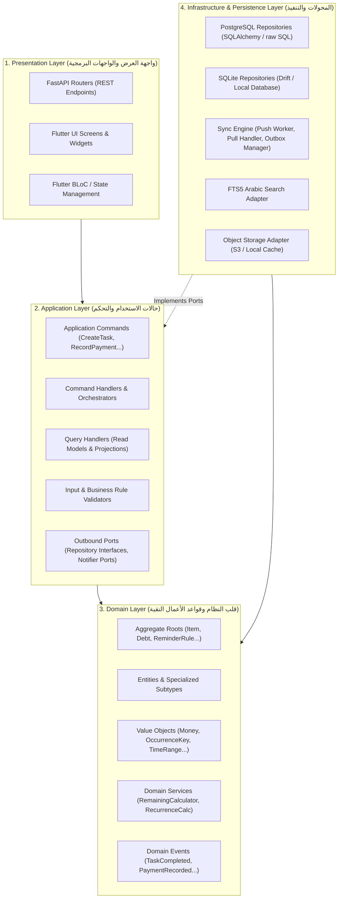
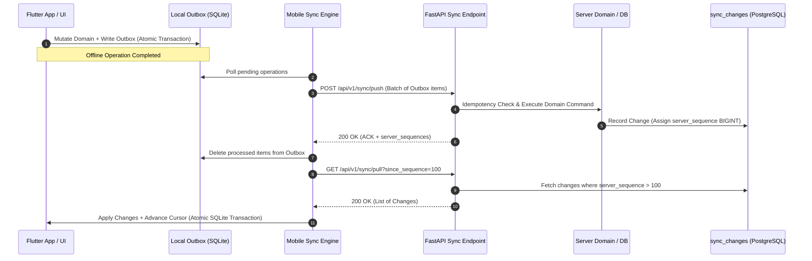
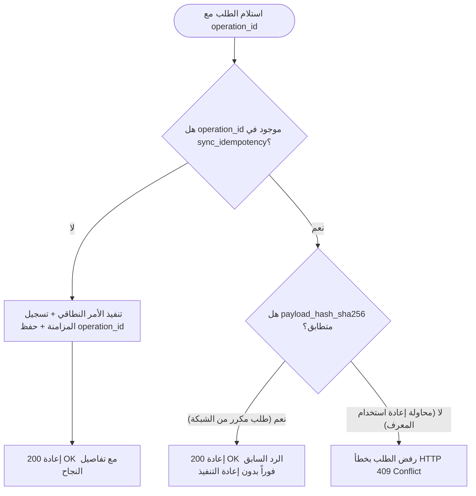

# IMPLEMENTATION ARCHITECTURE v1.0 — مشروع «مُعين» (Mouin)
## وثيقة المعمارية التنفيذية الرسمية والتصميم البرمجي الشامل (Execution & Software Architecture Specification)

**تاريخ الإصدار:** 2026-08-29  
**الإصدار المعماري:** `v1.0 FINAL`  
**الحالة:** معتمد رسمياً للتنفيذ البرمجي (`APPROVED FOR IMPLEMENTATION`)  
**المشروع:** «مُعين» (Mouin) — المساعد الذكي لإدارة المهام والمواعيد والديون والوثائق والملاحظات والتسوق (Offline-First Local Sync Assistant).

---

## 1. Executive Summary (الملخص التنفيذي)

تحدد هذه الوثيقة **المعمارية التنفيذية الرسمية (Implementation Architecture v1.0)** لمشروع «مُعين»، وهي الجسر المعماري والتقني الصارم الذي ينقل المشروع من مرحلة العقود والـ ERD وقواعد البيانات إلى مرحلة البرمجة الفعلية لطبقات الخادم (`FastAPI`) والعميل المحلي (`Flutter / Drift`).

تم بناء هذا التصميم لضمان تحقيق المبادئ الأساسية التالية:
1. **Single Domain Mutation Path**: حظر التعديل المباشر على قواعد البيانات من أي واجهة (`No REST->SQL`, `No Sync->SQL`, `No AI->SQL`). كل عملية كتابة تمر عبر: `Presentation -> Application Command -> Domain Aggregate -> Repository/Unit of Work`.
2. **Clean / Onion / DDD Layering**: فصل تام للمسؤوليات مع توجيه الاعتماديات إلى الداخل فقط، بحيث تظل طبقة الـ `Domain` معزولة وخالية من أي ارتباطات بأطر العمل (`FastAPI`, `Flutter`, `SQLAlchemy`, `Drift`).
3. **Local-First & Append-Oriented Concurrency**: دعم كامل للعمل دون اتصال بالإنترنت (`Offline`)، وتوليد الهويات بمعرفات `UUIDv7` على العميل، وتطبيق الحركات المالية التراكمية على الديون لمنع فقدان البيانات (`No Lost Updates`).
4. **Decoupled 4-Tier Reminder Engine**: التذكيرات ليست نوع عنصر (`Reminder is NOT Item Type`)، بل نظام فرعي متكامل رباعي المراحل: `ReminderRule -> ReminderInstance (مع occurrence_key) -> Notification -> Action`.
5. **Strict AI/Domain Boundary**: لا يملك الذكاء الاصطناعي أي صلاحية لتعديل بيانات النطاق مباشرة؛ بل يولد مسودة اقتراح (`AISuggestion`) تخضع لسياسات التحقق وتأكيد المستخدم الصريح قبل تحويلها إلى أمر نطاقي.

---

## 2. Source Documents (المرجعيات المعتمدة)

تم الالتزام التام بالوثائق والمراحل السابقة دون أي حياد:
* **`PRD v1.1`**: متطلبات المنتج الوظيفية ومسارات الاستخدام وسياق المستخدم.
* **`ARCHITECTURE_BASELINE v1.0`**: الميثاق المعماري الملزم (Flutter + SQLite محلياً، Python FastAPI + PostgreSQL سحابياً، عدم وجود Microservices أو Event Sourcing في MVP).
* **`DATA_API_SYNC_CONTRACT v1.0 FINAL`**: عقد البيانات والمزامنة الشامل الذي يحدد بروتوكول المزامنة، بنية الحزم، التكرار، والتعامل مع عدم الاتصال.
* **`ERD_FINAL v1.0`**: مخطط ونموذج البيانات التنفيذي المعتمد.
* **`DATABASE FOUNDATION v1.0`**: جداول PostgreSQL الـ 30، وجداول SQLite الـ 26، ونماذج Pydantic، واختبارات القبول (22/22 Tests Passing).

---

## 3. Architectural Principles (المبادئ المعمارية غير القابلة للكسر)

```text
┌─────────────────────────────────────────────────────────────────────────────┐
│                       ARCHITECTURAL CORE PILLARS                            │
├─────────────────────────────────────────────────────────────────────────────┤
│ 1. Item = Aggregate Root (Subtypes: Task, Appt, Note, Doc, Debt, Shopping)  │
│ 2. Reminder is NOT an Item Type (Independent 4-Tier Subsystem)              │
│ 3. Single Domain Mutation Path (Request -> Command -> Domain -> Persistence)│
│ 4. Client Generated UUIDv7 Identity (No Server ID Regeneration)             │
│ 5. BIGINT Server Sequence for Replication Stream Cursor                     │
│ 6. Append-Oriented Financial Ledger with Exact NUMERIC Precision            │
│ 7. Explicit Attachment Associations (Zero Loose Polymorphic FKs)            │
│ 8. Audit Events != Sync Changes (No Event Sourcing for Domain State)        │
│ 9. Atomic Transactions (Local Domain + Outbox / Pull Apply + Advance Cursor)│
│ 10. Privacy-by-Default (Only 'private' and 'sensitive' Classifications)     │
└─────────────────────────────────────────────────────────────────────────────┘
```

---

## 4. Layered Architecture (المعمارية الطبقية)

يعتمد المشروع نمط **Clean Architecture / Hexagonal Architecture (Ports & Adapters)** المدمج بمبادئ **Domain-Driven Design (DDD)** في كل من الخادم والعميل:



### مسؤوليات كل طبقة:
1. **Presentation Layer**: استقبال طلبات HTTP في الخادم (FastAPI) وتفاعل المستخدم في الهاتف (Flutter)، وتحويل المدخلات إلى DTOs أو أحداث BLoC دون أي منطق أعمال أو استعلامات SQL مباشرة.
2. **Application Layer**: تنسيق تدفق العمليات (Use Cases)، فتح المعاملات الذرية (`Unit of Work`)، التحقق من الصلاحيات، وتحويل الأوامر إلى تعديلات على الـ Domain Models واستدعاء الـ Repositories.
3. **Domain Layer**: الكيان النقي المحتوي على قواعد الأعمال الحتمية (`Invariants`)، والحسابات المالية الدقيقة، وقواعد التكرار، والتحقق من صحة الحالات. لا يعتمد على أي مكتبة خارجية.
4. **Infrastructure Layer**: تنفيذ واجهات الـ Repositories، التعامل مع محركات قواعد البيانات (`PostgreSQL` و `SQLite`)، إدارة الـ Outbox، المزامنة، التخزين السحابي، والبحث FTS.

---

## 5. Domain Architecture (معمارية النطاق وقواعد الأعمال)

### 5.1 نموذج الكيان الجامع (Item Aggregate)
* `Item` هو **Aggregate Root**.
* لا يمكن إنشاء أو تعديل أي نوع تخصصي (`Task`, `Appointment`, `Note`, `Document`, `Debt`, `ShoppingList`) بمعزل عن الكيان الأم `Item`.
* يحافظ `Item` على invariants المشتركة:
  * العنوان `title` إلزامي وغير فارغ.
  * نوع العنصر `item_type` محصور في الأنواع الستة المعتمدة.
  * الخصوصية `privacy_classification` تقتصر على `private` و `sensitive`.
  * حقول التعبير الزمني الطبيعي (`temporal_original_expression`, `temporal_resolved_at`, `temporal_timezone`).
  * عداد الإصدار `entity_version` يتزايد مع كل تعديل.

### 5.2 نموذج الديون والحسابات المالية (Debt Aggregate & Ledger)
* `Debt` هو الكيان التخصصي الحامل للمعلومات التعاقدية (الدائن/المدين، المبلغ الأصلي `total_amount`، العملة، تاريخ الاستحقاق).
* `DebtTransaction` هي القيود المحاسبية التراكمية التابعة للـ Debt (`1 : Many`):
  * حركات `payment`: دفعات تسدد جزءاً من الدين.
  * حركات `reversal`: إلغاء دفعة سابقة مع الإشارة إليها في `reference_transaction_id`.
  * حركات `adjustment`: تسوية مالية تصحيحية.
* **حساب المتبقي (Domain Service)**:
  $$\text{Remaining Amount} = \text{total\_amount} - \sum (\text{Valid Payments}) + \sum (\text{Reversals}) \pm \sum (\text{Adjustments})$$

### 5.3 نظام التذكيرات (Reminder Subsystem)
* خط الإنتاج المغلق:
  $$\text{ReminderRule} \longrightarrow \text{ReminderInstance} \longrightarrow \text{Notification} \longrightarrow \text{Action}$$
* **مفتاح المنع الفريد (Occurrence Key)**:
  $$\text{occurrence\_key} = \text{SHA256}(\text{rule\_id} + \text{":"} + \text{scheduled\_time\_iso})$$
* يضمن Domain عدم توليد نفس التكرار مرتين تحت أي ظرف.

---

## 6. Application Layer (معمارية التطبيق وحالات الاستخدام)

تعتمد طبقة التطبيق نمط **CQRS الخفيف (Command Query Responsibility Segregation)**:

```text
Application/
├── Commands/                    # أوامر التعديل (Mutations)
│   ├── CreateTaskCommand
│   ├── UpdateTaskStatusCommand
│   ├── CreateAppointmentCommand
│   ├── RecordDebtPaymentCommand
│   ├── ReverseDebtPaymentCommand
│   ├── CreateReminderRuleCommand
│   ├── ConfirmAISuggestionCommand
│   ├── CreateAttachmentCommand
│   └── SoftDeleteItemCommand
├── CommandHandlers/            # منفذو الأوامر وتنسيق المعاملات
│   ├── TaskCommandHandler
│   ├── DebtCommandHandler
│   ├── ReminderCommandHandler
│   ├── AIConfirmationHandler
│   └── SyncPushCommandHandler
├── Queries/                     # استعلامات القراءة (Read Models)
│   ├── GetWorkspaceItemsQuery
│   ├── GetDebtSummaryQuery
│   ├── GetPendingRemindersQuery
│   └── SearchItemsQuery
├── QueryHandlers/               # منفذو الاستعلامات السريعة
├── Validators/                  # محققات الأوامر والمدخلات
└── DTOs/                        # كائنات نقل البيانات
```

### مسار تنفيذ الأمر النطاقي الموحد (Single Mutation Path):
```text
1. Client/API Request
      │
      ▼
2. Request DTO Validation
      │
      ▼
3. Dispatch Application Command (e.g. RecordDebtPaymentCommand)
      │
      ▼
4. Command Handler fetches Aggregate from Repository
      │
      ▼
5. Aggregate executes business method (e.g. debt.record_payment(amount, date))
      │
      ▼
6. Domain Invariants validated (amount > 0, currency matches)
      │
      ▼
7. Unit of Work commits Transaction (Domain Mutation + Outbox / SyncChange + Event)
      │
      ▼
8. Return Response DTO
```

---

## 7. Persistence Architecture (معمارية الحفظ وقواعد البيانات)

```text
Domain Aggregate ──► Repository Port (Interface) ──► Infrastructure Repository (Adapter) ──► PostgreSQL / SQLite
```

### 7.1 نمط مستودع البيانات (Repository Pattern & Unit of Work)
* واجهات الـ Repositories معرفة داخل طبقة التطبيق/النطاق كـ **Abstract Ports**.
* يتم تنفيذ المحولات في طبقة الـ Infrastructure:
  * **`PostgresItemRepository`**: تستخدم استعلامات SQL و SQLAlchemy Core لمعالجة المعاملات السحابية.
  * **`SqliteItemRepository`**: تستخدم محرك SQLite في Python للاختبارات و Drift/SQLite في تطبيق Flutter.
* **`UnitOfWork` (UoW)**: يدير حدود المعاملة (`BEGIN ... COMMIT / ROLLBACK`) لضمان حفظ الكيان وحركة المزامنة وحركة التدقيق ذرياً.

---

## 8. Repository Architecture (واجهات وتوزيع المستودعات)

| المستودع (Repository Port) | العمليات الأساسية (Core Operations) | تطبيق الخادم (PostgreSQL) | تطبيق العميل (SQLite / Flutter) |
| :--- | :--- | :--- | :--- |
| **`IItemRepository`** | `get_by_id`, `save`, `soft_delete`, `list_by_workspace` | `PostgresItemRepository` | `SqliteItemRepository` |
| **`IDebtRepository`** | `get_with_transactions`, `save_debt`, `add_transaction` | `PostgresDebtRepository` | `SqliteDebtRepository` |
| **`IReminderRepository`** | `get_rule_by_id`, `save_rule`, `save_instance`, `get_pending` | `PostgresReminderRepository`| `SqliteReminderRepository` |
| **`IAttachmentRepository`**| `get_by_id`, `save_meta`, `link_item`, `link_debt_tx` | `PostgresAttachmentRepository`| `SqliteAttachmentRepository` |
| **`IInboxRepository`** | `get_pending`, `save_inbox_item`, `save_suggestion` | `PostgresInboxRepository` | `SqliteInboxRepository` |
| **`ISyncRepository`** | `record_sync_change`, `fetch_stream_since`, `check_idempotency` | `PostgresSyncRepository` | `SqliteOutboxRepository` |

---

## 9. Transaction Architecture (معمارية المعاملات الذرية)

### 9.1 معاملة الإرسال المحلي في العميل (Client Mutation & Outbox)
```text
BEGIN TRANSACTION (SQLite);
  1. Insert/Update local domain table (e.g. local_items + local_tasks)
  2. Insert into outbox (operation_id=UUIDv7, entity_type, payload, base_version)
  3. Update items_fts (via automatic trigger)
COMMIT;
```

### 9.2 معاملة استقبال الـ Push على الخادم (Server Push Transaction)
```text
BEGIN TRANSACTION (PostgreSQL);
  1. Check sync_idempotency by operation_id:
     - If exists with same payload_hash -> RETURN existing ACK (Idempotent)
     - If exists with different hash -> RAISE ConflictError (HTTP 409)
  2. Check entity_version & detect concurrency conflicts
  3. Apply Domain Mutation to relational tables (items, tasks, debts...)
  4. Insert into sync_changes (Allocates server_sequence BIGINT)
  5. Insert into events (Audit Log)
  6. Insert into sync_idempotency (operation_id, payload_hash, status='processed')
COMMIT;
RETURN ACK (server_sequence, new_entity_version);
```

### 9.3 معاملة تطبيق الـ Pull في العميل (Client Pull Transaction)
```text
BEGIN TRANSACTION (SQLite);
  1. For each remote change in batch:
     - Apply Upsert or Soft Delete to local tables
     - Reconcile local outbox entries for same entity
  2. Advance cursor: UPDATE local_sync_state SET last_synced_server_sequence = :max_seq
COMMIT;
```

---

## 10. API Architecture (معمارية واجهة البرمجة للخادم - FastAPI)

### 10.1 مبادئ التصميم
* **FastAPI Routers** تعمل كـ **Thin Delivery Adapters** فقط:
  * لا تحتوي على أي منطق أعمال أو استعلامات قاعدة بيانات مباشرة.
  * مسؤولة فقط عن: التحقق من التوثيق، استخراج معرف المستخدم ومساحة العمل، تحويل الـ Request Body إلى Application Command، واستدعاء الـ Command Handler.
* **إصدارات الواجهة (API Versioning)**: بادئة موحدة `/api/v1`.

### 10.2 مسارات الواجهة البرمجية الأساسية (Endpoint Taxonomy)
* **المزامنة (Sync Endpoints)**:
  * `POST /api/v1/sync/push`: استلام حزم العمليات من طابور Outbox.
  * `GET /api/v1/sync/pull`: جلب تدفق التغييرات المتسلسل بناءً على `since_sequence`.
  * `GET /api/v1/sync/bootstrap`: توليد لقطة بيانات متسقة مع مؤشر أولي.
* **العناصر والأنواع التخصصية (Item Endpoints)**:
  * `GET /api/v1/workspaces/{ws_id}/items`: استعراض العناصر مع الفلترة والترقيم.
  * `POST /api/v1/workspaces/{ws_id}/tasks`: إنشاء مهمة مباشرة (Online).
  * `POST /api/v1/workspaces/{ws_id}/debts`: إنشاء التزام دين.
  * `POST /api/v1/workspaces/{ws_id}/debts/{debt_id}/transactions`: تسجيل حركة مالية.
* **صندوق الوارد والذكاء الاصطناعي (Inbox & AI Endpoints)**:
  * `POST /api/v1/inbox`: رفع مادة خام (نص/صوت).
  * `POST /api/v1/inbox/{inbox_id}/suggestions/{sug_id}/confirm`: اعتماد اقتراح الذكاء الاصطناعي وتحويله لأمر نطاقي.

---

## 11. Sync Architecture (معمارية محرك المزامنة)



---

## 12. Bootstrap Architecture (معمارية التهيئة الأولية المتسقة)

لمنع حدوث أي فجوة في تدفق المزامنة بين اللقطة والتغييرات الجديدة (`No Gap Guarantee`):
1. يطلب العميل: `GET /api/v1/sync/bootstrap`.
2. يفتح الخادم معاملة قراءة لقطة واحدة (`Repeatable Read` أو لقطة متسقة في PostgreSQL).
3. يقرأ الخادم أعلى رقم تسلسلي حالي في تيار المزامنة:
   $$\text{Current Sequence} = \max(\text{server\_sequence})$$
4. يستخرج الخادم جميع السجلات النشطة غير المحذوفة التابعة لمساحة العمل في تلك اللحظة.
5. يعيد الخادم حزمة متسقة تحوي:
   $$\text{Bootstrap Package} = \{ \text{snapshot\_data}: [\dots], \text{initial\_cursor}: \text{Current Sequence} \}$$
6. يقوم العميل بمسح الجداول المحلية واستيراد اللقطة وتثبيت `last_synced_server_sequence = initial_cursor` في معاملة ذرية واحدة.
7. أي طلب `Pull` لاحق يبدأ من `initial_cursor + 1` دون أي فقدان أو تكرار.

---

## 13. Idempotency Architecture (معمارية ضمان عدم التكرار)

* كل عملية واردة من العميل تحمل معرف عملية فريد `operation_id` (منشأ كـ `UUIDv7`) وتجزئة محتوى الحزمة `payload_hash_sha256`.
* **مخطط القرار في بوابة عدم التكرار (Idempotency Gate)**:



---

## 14. Conflict Architecture (معمارية إدارة وحل التعارضات)

يتم حل التعارضات بطريقة واعية بالنطاق عبر **ثلاث مستويات حتمية**:

```text
┌─────────────────────────────────────────────────────────────────────────────┐
│                    3-TIER CONFLICT RESOLUTION MATRIX                        │
├─────────────────────────────────────────────────────────────────────────────┤
│ 1. المستوى الأول: الدمج التلقائي الآمن (Safe Auto Merge)                     │
│    - ينطبق على: الحقول غير المتداخلة في الكيان الواحد.                      │
│    - السلوك: دمج التعديلات تلقائياً وتحديث entity_version.                  │
│                                                                             │
│ 2. المستوى الثاني: الحل النطاقي الحتمي (Domain-Specific Resolution)          │
│    - ينطبق على: الحركات المالية (حركات الديون، بنود التسوق).                 │
│    - السلوك: حركات تراكمية (Append-Only) تُقبل معاً دون أي استبدال.        │
│                                                                             │
│ 3. المستوى الثالث: المراجعة الصريحة للمستخدم (Explicit User Resolution)     │
│    - ينطبق على: التعارض النصي المباشر على نفس الحقل (مثل نص الملاحظة).      │
│    - السلوك: تسجيل التعارض في sync_conflicts وإشعار المستخدم لاختيار النسخة. │
└─────────────────────────────────────────────────────────────────────────────┘
```

---

## 15. Financial Architecture (المعمارية المالية وسجل الديون)

1. **النزاهة الرقمية الحسابية**:
   * استخدام نوع `Decimal` في Python و `NUMERIC(14, 2)` في PostgreSQL و `TEXT Decimal` في SQLite.
   * حظر تام واستبعاد كامل لأنواع `Float/Double/Real`.
2. **سجل حركات تراكمي (Append-Only Ledger)**:
   * لا يوجد تعديل مباشر على أي حركة دفع معتمدة.
   * لتصحيح خطأ في دفعة بقيمة 500 ريال: يتم إنشاء حركة عكسية `reversal` بقيمة 500 ريال مع ربطها بالدفعة السابقة عبر `reference_transaction_id`.
3. **التزامن غير المتصل التراكمي (Offline Concurrency Resolution)**:
   * جهاز (A) يسجل دفعة 500 ريال دون اتصال $\rightarrow$ تنشأ `DebtTransaction` بـ `UUIDv7`.
   * جهاز (B) يسجل دفعة 700 ريال دون اتصال $\rightarrow$ تنشأ `DebtTransaction` بـ `UUIDv7` مستقل.
   * عند المزامنة، يقبل الخادم الحركتين في تيار المزامنة.
   * يجمع النظام الحركتين تلقائياً: $500 + 700 = 1200$ ريال دون حدوث أي تعارض أو فقدان.

---

## 16. Reminder Architecture (معمارية نظام التذكيرات والإشعارات)

```text
[Domain Service / Recurrence Engine]
         │ (حساب التكرارات عبر RFC 5545 RRULE)
         ▼
[ReminderInstance Generator]
         │ (توليد occurrence_key = SHA256(rule_id:scheduled_time))
         ▼
[Local / Server Scheduler]
         │ (فحص التذكيرات المستحقة pending)
         ▼
[Notification Delivery Adapter] ──► Local Push / System Tray
         │
         ▼
[User Action Handler] ──► Dismiss / Snooze (5m, 15m, 1h) / Mark Done
```

* **مسؤوليات التوليد (Generation Responsibilities)**:
  * يتم توليد حالات التذكير `ReminderInstances` عبر خدمة نطاقية `ReminderRecurrenceService`.
  * على الهاتف: ينشئ العميل التكرارات المحلية للأيام السبعة القادمة ويجدولها عبر `Local Notifications Adapter`.
  * قيد `UNIQUE(rule_id, occurrence_key)` يحمي قاعدة البيانات من تكرار أي إشعار حسابياً.

---

## 17. Attachment Architecture (معمارية المرفقات والملفات)

1. **دورة حياة المرفق (Lifecycle)**:
   * إنشاء المرفق وسجل البيانات الوصفية (`attachments`).
   * توليد تجزئة التشفير `checksum_sha256` للتأكد من سلامة الملف.
   * رفع الملف إلى **Object Storage** (أو حفظه في الكاش المحلي للموبايل).
2. **جداول الربط الصريحة (Explicit Associations)**:
   * `item_attachments`: ربط المرفق بالعنصر مع الترتيب والوصف.
   * `debt_transaction_attachments`: ربط سند القبض أو الفاتورة بحركة الدين.
   * `inbox_attachments`: ربط التسجيل الصوتي أو الصورة بصندوق الوارد.
3. **الحذف والأمان**:
   * عند حذف العنصر الأم، تُحذف روابط الارتباط تلقائياً (`ON DELETE CASCADE`).
   * الملف الفعلي في التخزين يخضع لسياسة تنظيف الملفات اليتيمة (`Orphan Cleanup Policy`).

---

## 18. AI Architecture (معمارية صندوق الوارد والذكاء الاصطناعي)

```mermaid
graph LR
    Input[مدخل خام: صوت / نص] --> InboxItem[inbox_items]
    InboxItem --> AIProcessing[AI Pipeline / LLM Extraction]
    AIProcessing --> AISuggestion[ai_suggestions (Staging)]
    AISuggestion --> ValidationPolicy[Validation & Business Policies]
    ValidationPolicy --> UserReview{مراجعة واعتماد المستخدم}
    UserReview -- رفض --> Rejected[تحديث الحالة إلى rejected]
    UserReview -- موافقة / تعديل --> Command[Application Command]
    Command --> DomainMutation[تعديل جداول النطاق: Task/Debt/Appt]
```

* **قاعدة الأمان الصارمة**: لا يملك الذكاء الاصطناعي أي وصول مباشر لطبقة الـ Persistence أو جداول النطاق. الاقتراح يبقى في `ai_suggestions` حتى يصدر أمر تطبيقي معتمد من المستخدم.

---

## 19. Offline Architecture (معمارية العمل دون اتصال)

* **العمليات القابلة للتنفيذ دون اتصال (Offline-Capable)**:
  * إنشاء وتعديل وحذف المهام، المواعيد، الملاحظات، الوثائق، الديون، حركات الدفع، وقوائم التسوق.
  * البحث المحلي في النصوص العربية عبر `FTS5`.
  * تشغيل الإشعارات والتذكيرات المجدولة مسبقاً.
* **العمليات التي تتطلب اتصالاً (Online-Required)**:
  * تسجيل حساب جديد لأول مرة وتوثيق الهوية السحابي.
  * معالجة الصوت بالذكاء الاصطناعي السحابي (إلا في حال توفر معالج محلي على الجهاز).
  * التهيئة الأولية `Bootstrap` لجهاز جديد.
* **استراتيجية التعافي عند الانهيار (Crash Recovery)**:
  * طابور `outbox` يحتفظ بحالة كل حركة (`pending`, `in_flight`, `failed`).
  * عند إعادة تشغيل التطبيق، يُعاد إرسال الحركات المعلقة تلقائياً بحسب `next_retry_at`.

---

## 20. Search Architecture (معمارية البحث المحلي)

* البحث السريع في الـ MVP هو **Infrastructure Concern** يعتمد على **SQLite FTS5**:
  * جدول البحث الافتراضي `items_fts` متصل مباشرة بجدول `local_items`.
  * مشغلات التزامن (`Triggers`) تحدث فهرس الكلمات تلقائياً عند الإضافة أو التعديل أو الحذف.
  * محول التطبيع العربي (`Arabic Normalizer`) يزيل التشكيل ويوحد الألفات والتاء المربوطة لضمان عثور المستخدم على النتائج بدقة فائقة.

---

## 21. Security & Privacy Architecture (معمارية الأمان والخصوصية)

1. **عزل مساحات العمل (Workspace Scoping)**:
   * كل استعلام في الخادم والعميل مفلتر حتماً بـ `workspace_id`.
   * في الـ MVP: يمتلك كل مستخدم مساحته الشخصية `personal workspace`، والنموذج معزول بحيث يستحيل الوصول لأي مورد عبر `id` بمفرده دون التحقق من العضوية.
2. **تصنيف الخصوصية (Privacy Classifications)**:
   * `private`: المستوى الافتراضي لجميع العناصر.
   * `sensitive`: مخصص للبيانات الحساسة مثل الوثائق الرسمية، الديون، وسندات القبض.
   * تفرض واجهة العرض قفل المصادقة البيومترية (بصمة/وجه) عند فتح العناصر المصنفة كـ `sensitive`.

---

## 22. Versioning Architecture (معمارية فضاءات الإصدارات الستة)

| فضاء الإصدار (Version Namespace) | من يزيد القيمة؟ | متى تزيد؟ | موضع التخزين | الوظيفة |
| :--- | :--- | :--- | :--- | :--- |
| **`app_version`** | فريق التطوير (Release) | عند بناء وتحديث التطبيق | `installations.app_version` | تتبع إصدار الهاتف والتوافقية |
| **`api_version`** | مهندس المعمارية | عند كسر التوافقية العكسية | مسار الـ URL `/api/v1` | توجيه طلبات الشبكة |
| **`db_schema_version`**| نظام Alembic / Drift | عند تطبيق Migration جديد | جداول إدارة الـ Migration | تتبع سلامة وهيكل الجداول |
| **`sync_protocol_version`**| محرك المزامنة | عند تعديل بنية حزم المزامنة | `installations.sync_protocol_version` | إدارة توافق بروتوكول المزامنة |
| **`entity_version`** | الكيان النطاقي (Domain) | مع كل عملية تعديل أو حذف للكيان | `items.entity_version`, `debts...` | القفل التفاؤلي وكشف التعارضات |
| **`ai_schema_version`**| خادم الذكاء الاصطناعي | عند ترقية هيكل مخرجات الاستخراج | `ai_suggestions.ai_schema_version` | معالجة توافق حزم الاقتراحات |

---

## 23. Error Architecture & Contract (معمارية وهيكل الأخطاء الموحد)

تعتمد الواجهة البرمجية هيكل خطأ قياسي موحد لجميع الردود:

```json
{
  "error": {
    "code": "IDEMPOTENCY_CONFLICT",
    "message": "Operation ID already used with a different payload hash.",
    "category": "CONFLICT",
    "timestamp": "2026-08-29T18:45:00Z",
    "details": [
      {
        "field": "operation_id",
        "issue": "Payload hash mismatch"
      }
    ]
  }
}
```

### تصنيف الأخطاء المعماري (Error Taxonomy):
* `VALIDATION_ERROR` (HTTP 422): عدم مطابقة مدخلات الـ DTO.
* `AUTHENTICATION_ERROR` (HTTP 401): رمز التوثيق مفقود أو منتهي الصلاحية.
* `AUTHORIZATION_ERROR` (HTTP 403): محاولة الوصول لمساحة عمل لا يملكها المستخدم.
* `RESOURCE_NOT_FOUND` (HTTP 404): الكيان غير موجود أو محذوف منطقياً.
* `CONCURRENCY_CONFLICT` (HTTP 409): تعارض في `entity_version`.
* `IDEMPOTENCY_CONFLICT` (HTTP 409): إعادة استخدام `operation_id` بـ Payload مختلف.
* `BUSINESS_RULE_VIOLATION` (HTTP 400): خرق قواعد النطاق (مثل مبالغ سالبة أو تواريخ غير متسقة).
* `INTERNAL_INFRASTRUCTURE_ERROR` (HTTP 500): خطأ في الخادم أو قاعدة البيانات.

---

## 24. Flutter / Drift Boundary (حدود العميل المحلي في Flutter)

```text
[Flutter Widgets / Screens]
        │
        ▼ (Events)
[BLoC / State Notifiers]
        │
        ▼ (Invokes Use Cases)
[Application Services / Use Cases]
        │
        ▼ (Calls Repository Interface)
[Drift Repositories (Infrastructure)]
        │
        ├──► Local SQLite Database (Local Domain Tables)
        ├──► Outbox Manager (Atomic Queue Entries)
        └──► FTS5 Search Engine
```
* **قاعدة صارمة**: يُحظر على واجهات Flutter UI استدعاء استعلامات SQL أو جداول Drift مباشرة. كل الوصول يمر عبر طبقة الـ Repositories.

---

## 25. FastAPI Boundary (حدود الخادم في FastAPI)

```text
[FastAPI Router (/api/v1/...)]
        │
        ▼ (Extracts Auth, Scopes, DTOs)
[Application Command / Query Handler]
        │
        ▼ (Executes Business Logic)
[Domain Aggregate / Domain Service]
        │
        ▼ (Saves State)
[PostgreSQL Repository (Unit of Work)]
        │
        └──► PostgreSQL Database (Tables + sync_changes + events)
```
* **قاعدة صارمة**: مسارات FastAPI لا تنفذ استعلامات قاعدة بيانات مباشرة؛ بل تعمل كمحولات لنقل الأوامر إلى طبقة التطبيق.

---

## 26. Testing Architecture (معمارية واستراتيجية الاختبارات)

```text
               ▲
              / \
             /   \     E2E & Acceptance Tests (Tests A to J)
            /─────\    Contract & Sync Replay Tests
           /       \   Application Command & Integration Tests
          /─────────\  Domain Unit & Invariant Tests
         ─────────────
```

### هرم الاختبارات وخطة التغطية:
1. **Domain Unit Tests**: اختبار حسابات المبالغ والمتبقي، قواعد التكرار، والتحقق من invariants في الذاكرة بدون قاعدة بيانات.
2. **Application Use Case Tests**: اختبار الـ Handlers والتحقق من استدعاء الـ Repositories وفتح المعاملات.
3. **Repository & Integration Tests**: اختبار استعلامات PostgreSQL و SQLite والتأكد من قيود المفاتيح والفهارس والتكامل المرجعي.
4. **Contract & Sync Tests**: اختبارات المزامنة الشاملة (Idempotency، التعارضات، تطبيق المؤشر ذرياً، والـ Bootstrap).

---

## 27. Migration Strategy (استراتيجية الهجرة وتحديث قواعد البيانات)

* **الخادم (PostgreSQL)**: إدارة التحديثات عبر **Alembic** بصيغة إصدارات بايثون متسلسلة (`versions/001_initial_schema.py`) مع سكريبتات SQL متوافقة.
* **العميل (SQLite / Flutter)**: إدارة التحديثات عبر **Drift Schema Versioning** مع توفير سكريبتات ترقية تصاعدية تحافظ على بيانات المستخدم المحلية وطابور الـ Outbox دون أي فقدان.
* **سياسة التوافقية (Compatibility Policy)**: الالتزام الصارم بعدم كسر توافق الحقول أثناء تشغيل نسخ قديمة من التطبيق (`Backward Compatibility`).

---

## 28. Project Structure (الهيكل البرمجي النهائي المقترح للمشروع)

### 28.1 هيكل الخادم (Backend - Python / FastAPI)
```text
backend/
├── app/
│   ├── main.py                     # نقطة انطلاق تطبيق FastAPI
│   ├── config.py                   # إعدادات البيئة والتكوين
│   ├── presentation/               # طبقة العرض والواجهات البرمجية
│   │   ├── api/
│   │   │   ├── v1/
│   │   │   │   ├── routers/        # مسارات REST (tasks, debts, sync...)
│   │   │   │   └── dependencies.py # حقن التبعيات والمصادقة
│   │   │   └── schemas/            # Pydantic Request/Response DTOs
│   ├── application/                # طبقة التطبيق وحالات الاستخدام
│   │   ├── commands/               # الأوامر والمنفذون
│   │   ├── queries/                # الاستعلامات ونماذج القراءة
│   │   ├── ports/                  # واجهات Repositories و Services
│   │   └── validators/             # محققات قواعد العمل
│   ├── domain/                     # طبقة النطاق النقية
│   │   ├── aggregates/             # الكيانات الجامعة (Item, Debt, Reminder)
│   │   ├── entities/               # الكيانات الفرعية والتخصصية
│   │   ├── value_objects/          # كائنات القيمة (Money, Timezone...)
│   │   ├── services/               # الخدمات النطاقية الحسابية
│   │   └── events/                 # أحداث النطاق (Domain Events)
│   └── infrastructure/             # طبقة التنفيذ والمحولات
│       ├── database/               # قواعد البيانات و Alembic
│       │   ├── postgres_schema.sql
│       │   ├── models/             # نماذج SQLAlchemy / DDL
│       │   └── migrations/         # إصدارات Alembic
│       ├── repositories/           # تنفيذ مستودعات PostgreSQL
│       ├── sync/                   # معالجات تدفق المزامنة السحابية
│       └── storage/                # محولات التخزين السحابي
└── tests/                          # حزم الاختبارات الآلية
```

### 28.2 هيكل العميل (Mobile - Flutter / Dart)
```text
mobile/
├── lib/
│   ├── main.dart                   # نقطة انطلاق التطبيق
│   ├── core/                       # الأدوات العامة والثوابت والمطابقات
│   │   ├── error/                  # تعريفات الأخطاء والاستثناءات
│   │   ├── network/                # عميل HTTP والمصادقة
│   │   └── utils/                  # معالجة النصوص والأوقات
│   ├── presentation/               # طبقة الواجهات والـ BLoC
│   │   ├── bloc/                   # إدارة الحالة (TaskBloc, DebtBloc...)
│   │   ├── screens/                # شاشات التطبيق
│   │   └── widgets/                # العناصر المشتركة
│   ├── application/                # طبقة حالات الاستخدام (Use Cases)
│   │   ├── usecases/               # UseCases (CreateTask, SyncData...)
│   │   └── ports/                  # واجهات المستودعات المحلية
│   ├── domain/                     # نماذج النطاق في Dart
│   │   ├── models/                 # كيانات النطاق وقواعد التحقق
│   │   └── value_objects/          # كائنات القيمة
│   └── infrastructure/             # طبقة التنفيذ المحلية
│       ├── database/               # قاعدة بيانات SQLite / Drift
│       │   ├── sqlite_schema.sql
│       │   ├── local_db.dart       # تهيئة قاعدة البيانات المحلية
│       │   └── daos/               # كائنات الوصول للبيانات (DAOs)
│       ├── repositories/           # تنفيذ مستودعات العميل المحلي
│       ├── sync/                   # محرك المزامنة المحلي وطابور Outbox
│       └── search/                 # محول البحث FTS5 العربي
└── test/                           # اختبارات الوحدة والواجهات في Flutter
```

---

## 29. Dependency Rules (قواعد واتجاهات الاعتماديات)

```text
Presentation Layer  ────────┐
                            ▼
Infrastructure Layer ──► Application Layer ──► Domain Layer (Core)
```

### القواعد الصارمة:
1. **طبقة النطاق (Domain Layer)** مستقلة تماماً ولا تعتمد على أي طبقة أخرى (`Zero Dependencies`).
2. **طبقة التطبيق (Application Layer)** تعتمد فقط على النطاق، وتحدد الـ Interfaces التي تحتاجها.
3. **طبقة البنية التحتية (Infrastructure Layer)** تعتمد على طبقتي التطبيق والنطاق لتنفيذ الواجهات.
4. **حظر تام**:
   * لا استيراد لـ FastAPI أو SQLAlchemy أو Flutter أو Drift داخل طبقة الـ `Domain`.
   * لا استدعاءات SQL مباشرة داخل طبقة الـ `Presentation`.

---

## 30. Contract Traceability (مصفوفة تتبع العقد المعماري إلى المكونات البرمجية)

| متطلب العقد المعماري | المكون البرمجي في المعمارية | المكون في قاعدة البيانات | الاختبار الآلي المتحقق |
| :--- | :--- | :--- | :---: |
| **Client-generated UUIDv7** | `IdentityService.generate_uuidv7()` | `id UUID PK / TEXT PK` | `Test A` |
| **Item Aggregate Root** | `ItemAggregate` + Subtype Handlers | `items` + Specialized Tables | `Test B, PG-6` |
| **Reminder Decoupling & Key** | `ReminderSubsystem` + `OccurrenceKeyService`| `reminder_rules` + `reminder_instances` | `Test C, PG-8` |
| **Atomic Outbox Mutation** | `OutboxCommandHandler` + `LocalUnitOfWork` | `outbox` + Local Domain Tables | `Test D` |
| **Exact NUMERIC Precision** | `MoneyValueObject` (Decimal) | `NUMERIC(14,2)` / `TEXT Decimal` | `Test E, PG-4` |
| **Append-Oriented Financials**| `DebtAggregate.record_payment()` | `debt_transactions` (Reversals/Adj) | `Test F` |
| **Idempotency Gate** | `IdempotencyMiddleware` / `SyncPushHandler`| `sync_idempotency` + Payload Hash | `Test G` |
| **Atomic Cursor Advance** | `SyncPullHandler` + `AtomicCursorService` | `local_sync_state` | `Test H` |
| **Workspace Scoped Access** | `WorkspaceAuthorizationService` | `workspaces` + Scoped Queries | `Test I` |
| **Tombstones Soft Delete** | `SoftDeleteCommandHandler` | `deleted_at` + `sync_changes(delete)`| `Test J` |
| **Explicit Associations** | `AttachmentAssociationService` | 3 Explicit Association Tables | `PG-5` |
| **Separation of Events/Sync** | `DomainEventPublisher` vs `SyncChangeRecorder`| `events` vs `sync_changes` | `PG-9` |
| **Arabic FTS5 Search** | `ArabicTextNormalizer` + `FTS5Repository` | `items_fts` + Sync Triggers | `SQL-3` |

---

## 31. Architectural Risks & Mitigations (المخاطر المعمارية وسبل التخفيف)

| الخطر المعماري (Architectural Risk) | الأثر المحتمل (Impact) | استراتيجية التخفيف المعتمدة (Mitigation) |
| :--- | :--- | :--- |
| **تعارض تعديلات النصوص دون اتصال** | فقدان أحد التعديلات | تفعيل المستوى الثالث لحل التعارضات (`sync_conflicts`) مع تمكين المستخدم من الاختيار الصريح. |
| **انقطاع الاتصال أثناء الـ Pull** | عدم اتساق البيانات والمؤشر | تنفيذ تطبيق التغييرات وتقديم المؤشر داخل **معاملة SQLite ذرية واحدة**. |
| **تكرار طلبات الشبكة (Push)** | تكرار العمليات المالية والنطاقية | استخدام `operation_id` (UUIDv7) وبوابة عدم التكرار `sync_idempotency` مع التحقق من تجزئة المحتوى. |
| **أخطاء التقريب المالي** | تباين في أرصدة الديون | استخدام نوع `Decimal` الصارم وحظر استخدام `Float` نهائياً على جميع المستويات. |
| **تراكم السجلات المحذوفة (Tombstones)**| زيادة حجم التخزين السحابي | جدولة مهمة دورية لتنظيف السجلات المحذوفة منطقياً بعد انقضاء فترة البقاء (90 يوماً). |

---

## 32. Open Questions & Roadmap Notes (الملاحظات والمسائل المعمارية المفتوحة)

1. **العمل الجماعي ومشاركة الفرق (Multi-User Collaboration)**:
   * تم تجهيز مساحات العمل والأعضاء معمارياً (`workspaces`, `workspace_members`). في الـ MVP، يتم تفعيل المساحة الشخصية الفردية فقط، مع إمكانية تفعيل مشاركة الفرق والعائلات مستقبلاً دون أي كسر في هيكل البيانات.
2. **البحث الدلالي المتقدم (Semantic / Vector Search)**:
   * تم اعتماد **SQLite FTS5** كبنية أساسية للبحث المحلي السريع في الـ MVP، مع عزل واجهة البحث بحيث يمكن دمج محرك تضمين محلي (Local Embeddings) في مراحل لاحقة.

---

## 33. Implementation Readiness Checklist (قائمة الجاهزية للتنفيذ البرمجي)

- [x] تم اعتماد وتوثيق الـ PRD والعقد المعماري والـ ERD.
- [x] تم إنشاء واختبار مخططات قواعد البيانات PostgreSQL و SQLite.
- [x] تم التحقق من اجتياز 22/22 اختباراً آلياً بنسبة نجاح 100%.
- [x] تم تحديد مسار تعديل النطاق الموحد ومنع الوصول المباشر لقواعد البيانات.
- [x] تم تحديد مسؤوليات كافة الطبقات (Domain, Application, Infrastructure, Presentation).
- [x] تم تحديد واجهات المستودعات (Repository Ports) وحدود المعاملات الذرية.
- [x] تم توثيق آليات المزامنة والتهيئة الأولية وعدم التكرار وإدارة التعارضات.
- [x] تم تحديد الهيكل البرمجي النهائي للخادم وتطبيق الهاتف.

---

## 34. Final Approval Status (حالة الاعتماد النهائية)

```text
================================================================================
               IMPLEMENTATION ARCHITECTURE v1.0: APPROVED
================================================================================
  Domain Integrity:     100% Compliant with PRD v1.1 & Contract v1.0
  Persistence State:    PostgreSQL (30 Tables) + SQLite (26 Tables) Verified
  Test Verification:    22/22 Automated Tests Passing
  Next Phase:           FastAPI Backend & Flutter Mobile Implementation
================================================================================
```
